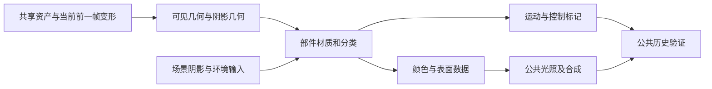

> 由 astra 生成 · 首次发布于 2026-09-27 18:44 · 最近整理于 2026-09-28 20:56（北京时间）

本篇在各游戏角色分析完成后，比较几何、材质、环境接入和时序输出的实现差异。完整公式、部件管线与实截帧配图保留在六份独立文档中；场景公共机制另见 [场景实现对比](/2026/09/27/scene-comparison/)。

| 游戏与截帧 | 单独场景分析 | 单独角色分析 |
|---|---|---|
| 绝区零：蕾米大厅 | [场景实现](/2026/09/27/zzz-scene/) | [角色实现](/2026/09/27/zzz-character/) |
| 原神：木偶雪城 | [场景实现](/2026/09/27/genshin-scene/) | [角色实现](/2026/09/27/genshin-character/) |
| 终末地：竹林场景 | [场景实现](/2026/09/27/endfield-scene/) | [角色实现](/2026/09/27/endfield-character/) |

<!-- more -->

## 1. 角色颜色在何处完成

| 全屏光照结束 | 后续几何着色完成 | 最终角色外观 |
|---|---|---|
|  |  |  |

**观察角色轮廓内部，背景位置保持一致。** 全屏光照结束时角色仍是黑色轮廓；后续几何阶段填入金发、肤色、白裙与金属亮部，直接证明角色颜色在这一阶段补入。前两图统一采用 HDR 显示范围 0–0.2，第三图为最终输出色彩；这里比较的是阶段贡献，不是 GI 或阴影开关。

| 问题 | 绝区零 | 原神 | 终末地 |
|---|---|---|---|
| 专用材质怎样进入整帧 | 脸部在材质阶段写已着色 HDR；眼睛随后按覆盖率合成 | 各部件生成公共表面数据，带专用明暗、法线与分类控制 | 公共准备之后，后续几何直接补角色颜色与运动 |
| 环境怎样进入角色 | 专用材质消费附加/级联阴影、实体数据与局部遮蔽 | 场景颜色与阴影采样成反馈，部分顶点路径读取已有结果 | 按位置和方向查询光照体积，再应用累计雾 |
| 哪些结果继续服务后面 | 法线、运动、模板状态与像素身份 | 法线/颜色/类别；法线用途结束后再生成运动 | HDR、运动/分类以及辅助几何数据 |

角色渲染不是只生成一张可见颜色图。它还要告诉公共光照和后处理“这是什么表面”“如何接受环境”“上一帧对应哪里”。三者把这些职责放在不同阶段，因此单独移植一个脸或身体像素程序会漏掉关键输入。

## 2. 几何变形与细分：已知程度必须对齐

绝区零已还原稀疏形态记录：目标顶点索引加位置、法线、切线增量，按权重累加到可变顶点。翅膀另用计算路径处理边与邻接，再生成索引；平滑候选采用与 Loop 边规则一致的权重，并受距离、强度和位图约束。

原神已确认几何准备与主材质分离，不同部件可以共享顶点路径、搭配不同像素材质；每个网格的 CPU/GPU 蒙皮职责尚未还原。终末地也存在实体/几何准备，但本次最明确的额外机制是辅助法线、深度和标记先被栅格化，再反馈给顶点阶段处理几何。

这三类证据分别回答“如何累加形态”“几何与材质如何组合”“纹理结果如何参与几何”，不能用后两者尚未还原的部分，推导它们没有形态混合或没有细分。

## 3. 明暗分区：投影阴影、脸部 SDF 与贴图设计方向

| 已拆解路径 | 控制明暗的输入 | 求值方式 | 作用边界 |
|---|---|---|---|
| 绝区零脸部 | 附加阴影深度、级联阴影、法线与材质颜色 | 法线偏移后比较采样；附加阴影使用九点核；颜色还有 HSV 型处理 | 这里确认的是该脸部程序，不据此否定其他变体的 SDF 能力 |
| 原神脸部 | 模型局部光方向、SDF、镜像/阈值参数 | 镜像 U 后由 R/A 组合阈值，与局部方向阈值比较，再做可调陡度 S 形过渡 | SDF 结果仍需和阴影色、高光、边缘项组合 |
| 终末地后续几何 | 局部光侧别、材质控制图、几何法线与 ramp | 从控制图恢复设计方向并混合几何法线；R/G 控制平滑分界，再采样色彩 ramp | 尚未把该程序精确对应到每个脸/发/身体部件 |

投影阴影主要回答光路是否被几何遮住；脸部 SDF 提供作者设计的方向明暗边界；贴图方向和 ramp 则进一步控制表面方向与颜色响应。它们处理的输入不同，可以在同一材质里组合，不能把任一项单独叫“完整 toon 光照”。

完整规则：[绝区零脸部与阴影](/2026/09/27/zzz-character/)、[原神 SDF 与表情](/2026/09/27/genshin-character/)、[终末地几何方向控制](/2026/09/27/endfield-character/)。

## 4. 眼睛：颜色合成与瞳孔空间感是不同职责

绝区零的眼睛颜色接入：

| 眼睛合成之前 | 眼睛合成之后 | 最终脸部效果 |
|---|---|---|
|  |  |  |

**直接看两眼的眼白区域。** 前两图取相同 HDR 区域和显示设置：合成后出现紫色虹膜、瞳孔与眼内亮点，脸部其他明暗基本不变，说明眼睛作为独立颜色贡献接入。第三图包含后续着色、抗锯齿和颜色处理，用于对照最终外观；不能把它相对中图的全部变化都归因于眼睛程序。

原神的眼睛材质写入：

| 眼睛材质写入之前 | 眼睛材质写入之后 | 最终脸部效果 |
|---|---|---|
|  |  |  |

**观察眼白中蓝色虹膜与内部亮部的出现。** 前两图是同一材质颜色目标的相邻阶段，直接显示眼睛程序写入的内容；头发等后续部件尚未完全覆盖，所以前额与最终图不同。第三图展示最终组合效果。解析视差随视角变化的幅度仍需多视角验证，不能由这组三张静止图单独证明。

绝区零眼睛输出已乘覆盖率的 RGB，用 `新色=眼睛色+底层色×(1-覆盖率)` 合成；同时分别控制其他附件的写入。它还可在曝光/对数压缩后采样角色专用颜色查找表。这里重要的是**如何覆盖可见颜色，又保留后续仍需使用的表面数据**。

原神眼睛则已还原到解析视差：局部视线在 UV 平面推进，由瞳孔半径轮廓寻找穿越点，再插值细化。步数随视角从约 4 到 16 变化，循环不逐步读取高度图；之后才叠加多层瞳孔纹理、混合 ramp、球面方向与 Matcap。这里重要的是**视角如何改变采样位置与高光**。

二者不是可以直接替换的同一个步骤：一个明确控制合成与颜色变换，另一个明确控制内部材质空间感，移植时两类职责都可能需要。终末地本次尚未完成眼睛专用路径归属，不补写未经证实的眼球公式。

## 5. 衣料与高光不能只比较一张 ramp

原神裙装从位置与 UV 的屏幕导数建立局部切线，结合基础和细节法线；材质控制图通过分段阈值选择参数组，分别影响阴影、高光和细节响应。因此一件裙装内部可以有多种表面行为。

终末地已拆解的后续几何将金属混合量同时用于漫反射与镜面基色：漫反射含 `0.96×(1-m)`，镜面基色在介质反射与表面颜色之间混合；高光宽度与粗糙度类参数的平方有关，之后仍可接受风格化控制。它又把设计方向和 ramp 接入明暗分区。

绝区零本次更深入的是脸、眼、几何与阴影路径，尚未把所有衣料变体拆到同等粒度。比较结论因此是：已确认的材质都要结合**颜色、方向、区域控制和合成位置**；不能因为最终画面具有卡通风格，就省略这些具体表面机制。

## 6. 环境反馈与直接空间查询的区别

| 环境接口 | 原神角色传感器 | 终末地空间光照 |
|---|---|---|
| 取什么 | 场景材质颜色及阴影比较结果 | HDR 基准幅度与 RGB 各自的方向系数 |
| 怎样聚合 | 每组五个空间点，排除无效点；颜色与阴影采用不同更新规则 | 在体积内部采样，并在近/中/远覆盖边界混合 |
| 方向如何影响 | 由后续角色程序消费反馈；本次反馈本身不是完整方向辐照度表示 | 与着色方向直接求点积，恢复该方向的环境贡献 |
| 时间依赖 | 部分角色先读已有结果，场景阶段随后汇总更新 | 当前几何读取已有空间场，当前帧未观察到场本身更新 |

原神环境颜色本帧使用 `新值=0.9×旧值+0.1×有效点均值`；阴影区却使用偏差与响应增益驱动的双通道状态。把两区统一改成一次 RGB 平均，会改变阴影响应。

终末地则在位置查询之后按方向重建环境光，再让累计雾的透射与散射作用于已着色颜色。空间覆盖过渡、方向编码与视线雾属于不同环节，需要分别保留。

绝区零已确认专用材质消费阴影和角色数据，胶囊路径另提供几何遮蔽；其全部角色环境输入尚未还原到与上述两条完全对应的模型，因此不强行凑成同一种传感器或体积接口。

## 7. 分类和独立混合是角色算法的一部分

| 机制 | 绝区零 | 原神 | 终末地 |
|---|---|---|---|
| 分类如何保留 | 阴影分类先检查模板 bit 7，只改 bit 2，保留其他状态 | 身体与眼睛模板分别为 0x85/0xA5，相差 bit 5 | 公共光照按低位分类，后续几何和辅助路径各有自身状态 |
| 颜色怎样写 | 脸先写 HDR；眼睛预乘合成，各附件写掩码不同 | 主材质写公共数据，后续按分类消费 | 角色所在几何路径在已有深度上补颜色，辅助路径再合成 |
| 分类还影响什么 | 局部遮蔽与后续通道解释 | 环境采样过滤、光照和历史策略 | 光照分流、辅助范围和历史验证 |

因此模板不是单纯“是否绘制”的开关，混合状态也不是程序之外无关紧要的配置：它们定义本次颜色是覆盖、追加，还是只标记一个待处理区域。省略它们会使相同公式参与不同的最终运算。

公共类别纹理与深度附件中的模板又是两套接口。原神材质类别图的高两位和眼睛模板 bit 5 不能按数字位置直接对应；必须沿各自的生产者和消费者解释。

## 8. 运动编码与生成时间要一起保留

| 数据关系 | 绝区零 | 原神 | 终末地 |
|---|---|---|---|
| 已确认的编码 | 有符号平方根压缩，中心 127/255 | 有符号平方根压缩，中心 127/255 | 连续两次平方根压缩，中心 0.5 |
| 主消费者解码 | `sign(q)×(2q)²`，q 为减去编码中心后的值 | 同左 | `sign(e-0.5)×(2e-1)^4` |
| 何时生成 | 脸部材质扩展通道已有运动，后续组织公共运动/身份 | 法线消费完成后，相机和几何路径重新写运动 | 后续几何与效果继续更新颜色及运动/分类 |
| 必须同步的内容 | 变形后前后位置、当前分类与像素身份 | 前后动画位置、类别/覆盖与历史状态 | 前后几何、深度、运动与有效性标记 |

运动是前后帧的屏幕对应关系，不是骨骼世界速度。当前姿态正确但上一帧位置不一致，仍会让历史采样取错表面。编码中的中心偏置、幂次和 y 方向也必须跟消费者配对。

终末地代表输出的 alpha=0.4 写入 2-bit UNORM 后落到 1/3 档，后续分类判断针对量化后的值；不能把源程序常量当作读回的精确数值。这类格式语义比附件编号更直接影响实现。

## 9. 角色接入场景需要保持的完整链条

这是一张职责关系图，不表示三个游戏具有相同执行顺序。具体接入应保留：

1. 共享只读资产与每实例姿态/形态状态分开，避免不同角色互相覆盖变形结果。
2. 变形结果同时满足可见、阴影和运动路径；间接生成的几何还要保留顶点/索引布局。
3. 材质与分类、附件语义、独立混合一起定义，不能只替换像素公式。
4. 环境输入按实际的先读后写或直接空间查询方式接入，保留各自平滑与方向性。
5. 等角色、透明和效果的公共颜色/运动写完，再执行整帧历史处理。

这些是由本次数据依赖提出的实现要求，不代表已经恢复三个游戏的 CPU 类结构。项目落地可另对照 [MMD 基础设施](/2026/09/27/mmd-infrastructure-design/) 与 [角色数据流](/2026/09/27/character-render-data-flow/)。

## 10. 仍不能横向下结论的部分

终末地部分匿名程序的角色部件归属、三者所有头发/透明/衣料变体、完整蒙皮分工和多帧历史交换仍未全部还原。没有同等证据的项目标为未知，不拿一种游戏的公式补到另一种游戏里。

需要检查某项计算时，先回到对应的独立角色分析，再通过语义链接查看 [原始角色证据](/2026/09/27/scene-capture-comparison-character-binding-details/)。
