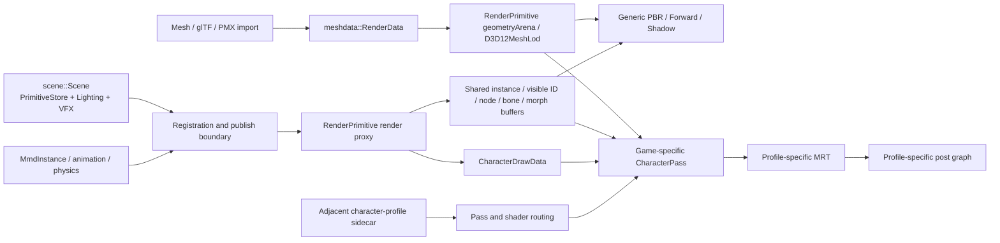

> 由 astra 生成 · 首次发布于 2026-09-27 18:44 · 最近整理于 2026-09-28 20:56（北京时间）

状态：Implemented
日期：2026-09-27

## 1. 架构约束

普通模型、原生角色与逆向角色在进入 Pass 以前使用同一条场景数据流。逆向 profile
只选择专用 shader、固定状态、ABI 打包、MRT 和后处理图，不能建立另一套相机、Root、
实例、节点、骨骼、morph、可见性或几何生命周期。



`CharacterDrawData` 是自定义角色 Pass 的实时 CPU 视图。它从 `RenderPrimitive` 构建，包含
node、instance、current/previous object-to-world 以及共享 GPU scene descriptor。各游戏
Pass 必须从这个对象打包自己的常量 ABI，不能从提取快照恢复运行时姿态。

<!-- more -->

## 2. 共享与专用边界

| 数据或行为 | 所有者 | 自定义 Pass 的使用方式 |
|---|---|---|
| 几何 payload、stream、attribute、唯一 IB、section range | `meshdata::RenderData` / `D3D12MeshLod` | 使用统一 batch 选择与验证 |
| Root/instance current 与 previous transform | `MeshInstance` / `RenderPrimitive` | 从 `CharacterDrawData` 打包，或绑定共享 instance SRV |
| node current 与 previous transform | `Mesh` cache / `RenderPrimitive` history | 从 `CharacterDrawData` 打包，或绑定 node SRV |
| GPU culling 与 visible IDs | 通用 RenderPrimitive GPU-driven path | 单实例 profile 直接消费共享 indirect args；兼容多实例的 shader 可绑定 visible-ID SRV |
| bones 与 morph weights | 通用 deformation runtime | 通过 profile resource role 映射到共享 descriptor |
| camera 与 directional light | `RenderPassContext::viewHistory` / `lighting` | 每帧写入游戏专用语义 ABI |
| shader、root layout、fixed state、draw order | `.character-profile.json` 与游戏专用 Pass | profile 独立拥有 |
| MRT、resolve 与 post graph | `RenderGraph` / 游戏专用 Pass | graph 拥有纹理，专用 Pass 定义访问和处理；当前场景仅启用一组兼容 Profile |

当前 ZZZ、Azur 和 Endfield 的 shader ABI 不相同，所以各自保留独立 `PackDrawData`。
共享基类只实现 pipeline/profile 加载、资源绑定、统一几何 batch 和执行机制。

## 3. Profile 资产边界

Profile 必须位于模型旁边并精确命名为：

```text
<model-file-name>.character-profile.json
```

加载器只检查这个精确 sidecar，不按目录猜测 profile，也不允许一个逆向资产劫持同目录
的普通模型。Profile 中的 `assetRoot`、`drawManifest`、`constantTemplateRoot`、纹理与 buffer
是只读资产。常量模板可保留未知字段和源 ABI padding，但运行时已知的 transform、camera、
light、viewport、history 与 scene resource 必须由实时数据覆盖。

`resourceRoles` 可把源资源 ID 映射到共享 render descriptor：

- `instanceData`
- `visibleInstanceIds`
- `nodeWorld`
- `boneMatrices`
- `morphWeights`

只有 profile 特有且不可由场景生成的纹理、查找表或静态 buffer 才由自定义 Pass 加载。

## 4. 截帧数据的用途

RDC 中提取的 geometry、texture、buffer 和常量快照有两个用途：

1. 构建不可变 RenderData/profile 资产；
2. 在离线 RenderDoc replacement validation 中验证 shader 与 Pass 的无损替换。

编辑器运行时没有 capture-reference 开关。原始 shader、固定相机或逐 draw 矩阵快照不能
绕开逻辑场景注册流程或 `RenderPrimitive`。这保证 gizmo、序列化、实例增删、动画、GPU culling、motion vector 与
普通角色遵守相同语义。

## 5. 帧时序

Root 或 node 第一次在一帧内被编辑时，renderer 保存帧开始前的 transform。后续同帧编辑
只更新 current。所有几何和后处理 Pass 执行完成后，history 统一推进为
`previous = current`，并在下一帧上传。这样 motion/AA 看到完整的一帧位移，而不是最后
一次 gizmo 增量。

相机使用同一规则。`RenderPassContext::viewHistory` 在录制 Pass 前一次性冻结当前与上一帧
的 position/target/up、投影参数和矩阵；全部 Pass 完成后才推进历史。游戏专用 ABI 可以做
坐标系转换，但不能维护另一套相机时间线。

洛茜、洛洛、蕾米的 `render.taa` 默认开启。采样使用独立于 backbuffer slot 的渲染帧序号和
16 点零均值 Halton 序列，偏移随共享 `RenderViewSnapshot` 一起冻结。运动向量使用
不带偏移的 current/previous 矩阵；光栅化与深度重建使用一致的偏移和坐标系转换。
`EndfieldLuoxiTemporalPass` 的颜色、深度和运动历史是三个 persistent 帧图资源，
颜色保留 resolve 的 confidence alpha。每帧 resolve 读取上一帧历史，随后在同一
graphics queue 上复制当前结果供下一帧使用。首次使用、资源重建、帧中断、场景变化、
相机跳转/投影变化、开关切换和 shader reload 均重置历史。
洛洛两段 TAA 共用最终输出的 persistent 颜色历史，Mobile 阶段另维护 R8 遮罩；
蕾米在 primary lighting 与 LUT 之间维护 R11G11B10F 颜色及 R8 ID 历史。
公共 shader 运算集中在 `TemporalAACommon.inl`，各自的采样、裁剪和融合逻辑保持独立。
其他 profile 不自动套用这些算法；原神 FSR 不在此开关的实现范围内。

各游戏的运动编码、历史资源、裁剪/融合算法及接入状态见
[角色截帧中的 TAA 实现对比](/2026/09/27/taa-implementation-comparison/)。

单实例逆向资产已经通过共享 GPU culling 的 indirect args 绘制。多实例自定义绘制只有在
该 profile 的语义 shader 按 visible instance ID 读取共享 instance/node 数据后才使用一次
indirect draw；旧的逐 draw 常量 ABI 仍按实例循环，但其 CPU 输入同样来自
`CharacterDrawData`，不形成第二套场景状态。

## 5.1 场景驱动的 Profile 生命周期

`CharacterProfileRuntime` 只接收场景模型的精确 adjacent sidecar，并以规范化绝对路径
作为运行时身份。相同 `profileId` 的不同 sidecar 不是同一资源实例；不再扫描
`Assets/model` 按 ID 取第一个文件。普通场景无需安装其他角色资产。

场景只创建选中 Profile 的角色与后处理 Pass。切换场景时，新 Pass 使用暂存的 pipeline
快照和另一组预留 descriptor slots 初始化；所有上传完成后才发布新一代 pipeline，
并释放旧 Pass。两组 descriptor 区域在 scene checkpoint 之前预留，场景纹理回收不会
覆盖 Profile 的常驻资源。Azur 后处理热重载复用原 descriptor slots，提交前不会修改
旧 descriptor；改变常驻纹理解释、深度源或 buffer 绑定集合需要重新加载场景。

目前 character MRT 与最终后处理链仍为一个场景域，尚无不同游戏或不同 Profile 变体
之间的合成协议。因此 `scene.add` 在任何场景变更前拒绝不同 sidecar 的组合，并返回
明确错误。相同 sidecar 的多个模型及多个实例均可绘制；不会静默漏画或互相清空。

角色 Pass 收集全部匹配模型，按模型/实例分别打包 `CharacterDrawData`，在同一次 MRT
清理后完成绘制；后处理仍对这一场景域执行一次。不同 sidecar 即使声明相同 `profileId`
也会被预检拒绝；这不构成任意 Profile 组合与独立后处理合成的支持。

Profile 屏幕纹理由 RenderGraph 的活跃 lifetime 决定驻留。停用时连同历史纹理释放，
SRV/UAV 保留稳定 null view；重新启用或 resize 后通过 allocation revision 重置历史。
释放和描述符改写先等待 GPU idle，之后才发布当前帧的描述符副本。

## 6. 验收要求

新增或恢复一个逆向角色时必须满足：

1. 普通模型与逆向角色都由同一 `RenderPrimitiveRegistry` 中注册的 `RenderPrimitive` 提供 geometry、instance、node 与 deformation；
2. profile 使用精确 adjacent sidecar，不使用路径或材质名前缀猜测；
3. Root/Node 移动、相机和方向光修改能立即驱动专用 Pass；
4. current/previous transform 来自共享帧历史；
5. 每个游戏拥有独立 program identity、shader、ABI packer 与 post graph；共用 MRT 的 Profile 必须在场景提交前验证兼容性；
6. 捕获快照只作为模板或离线验收输入；
7. 通用 PBR/Forward/Shadow 不重复消费专用 profile 的几何；
8. build、CTest、编辑器加载、移动实例与截图闭环通过。
