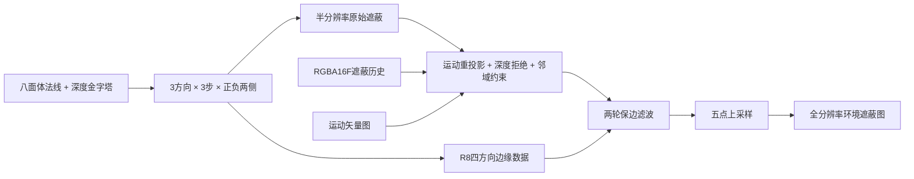
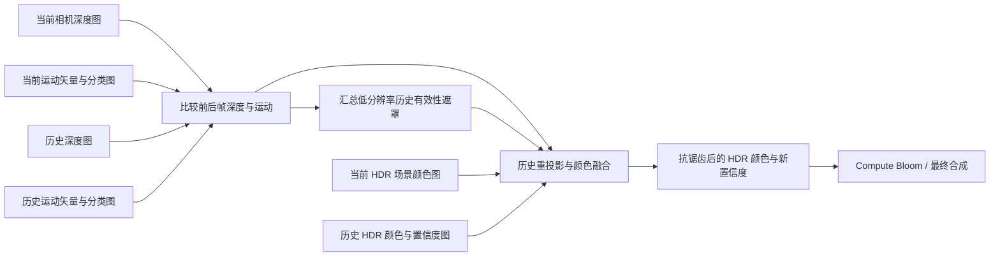

> 由 astra 生成 · 首次发布于 2026-09-27 18:44 · 最近整理于 2026-09-28 10:32（北京时间）

分析日期：2026-09-27。输入为本机 `终末地场景.rdc`。分析竹林山地中的深度/材质准备、方向光照体积、AO、历史反射、积分雾与 HDR 后处理。

本文完整展开本截帧的场景逻辑；角色内部算法见 [角色分析](/2026/09/27/endfield-character/)。跨游戏结论另见 [场景实现对比](/2026/09/27/scene-comparison/)，回放定位见 [证据索引](/2026/09/27/scene-capture-comparison-capture-index/)。

<!-- more -->


总览用于定位场景；算法旁的局部图采用同一区域对照，并写明可观察的变化。阶段配对保持一致显示设置，HDR 预览范围与最终输出颜色分别说明。图片直接从真实回放生成，未修改截帧资源。

## 1. 管线与数据依赖

| 阶段 | 处理逻辑 | 输出的作用 |
|---|---|---|
| 阴影与雾 | 建立各视图的遮挡，计算局部雾的散射/消光并沿视线积分 | 表面和角色着色可直接查询已积累的雾色与透射 |
| 深度与主材质 | 先建立可见表面深度，再生成法线、颜色、材质参数和运动 | 为屏幕空间位置重建及分类着色提供公共输入 |
| 屏幕环境处理 | AO 从深度搜索遮挡并滤波；反射用追踪坐标读取旧 HDR 颜色并过滤 | 补入与当前视图可见性相关的环境信息 |
| 全屏与几何着色 | 场景延迟着色读取方向光照体积、阴影、AO 和反射；后续几何补入角色颜色与运动 | 材质专用着色与场景公共环境在同一 HDR 画面汇合 |
| 辅助/透明合成 | 合成辅助几何与效果，保持公共运动和分类信息有效 | 让晚绘制内容也参与后面的历史判断 |
| 历史验证与输出 | 先检查深度/运动/分类变化，再融合 HDR；随后多尺度泛光和最终颜色处理 | 反射与抗锯齿都读取旧颜色，必须在两个消费者完成后更新其版本 |

## 2. 公共表面数据、深度与分类着色

| 数据用途 | 本截帧的生成与编码 |
|---|---|
| **表面法线图**：保存表面朝向，决定光照与遮蔽 | RG 使用八面体编码，RGB10A2 |
| **材质颜色图**：为后续着色提供表面颜色 | RGBA8 sRGB |
| **HDR 光照颜色图**：存放已计算的亮度与颜色 | R11G11B10F；材质结束时近黑，后续逐步加入光照 |
| **运动矢量图**：保存前后帧屏幕位移，定位历史像素 | RGB10A2；同时包含时序分类，后续几何/效果继续更新 |
| **附加材质参数图**：控制表面如何接受后续光照 | RGB10A2；完整反射/材质参数位域未全部解码 |
| **材质类别/扩展标记图**：选择处理分支 | 主运动图的附加通道与模板分类共同承载 |
| **相机深度与模板图**：遮挡测试、空间位置重建与分类 | D32S8 |

主相机先建立深度，材质阶段在此基础上写入表面信息并可继续写深度。法线用 RG 八面体编码；环境遮蔽把它解码回三维方向，再转到观察空间。

全屏延迟光照按模板低三位区分类别 0、1、2，保留深度，并使用以下颜色合成关系：

`新颜色 = 本次光照颜色 + 已有颜色 × 本次输出alpha`

本次 alpha 控制已有贡献的保留程度。各分支分别处理匹配表面；分类、通道解释与混合关系一起决定光照含义。

## 3. 场景延迟光照与后续几何的分工

主材质先为场景建立颜色、方向与分类，后续几何再直接读取环境光照体积和雾，输出专用材质颜色与运动。透明和效果也继续写公共结果，因此完整颜色与运动必须在这些生产者结束后才能交给时序阶段。角色所在路径的材质公式见 [终末地角色分析](/2026/09/27/endfield-character/)。

## 4. 阴影同时影响表面受光和雾

阴影图集把不同光源视图放在各自区域更新。表面延迟光照读取它判断几何受光；雾体积也读取阴影，使被物体挡住的空间减少光照散射。阴影因此同时决定“物体有多亮”和“空气中的光是否被遮住”。

另有独立辅助深度/颜色路径，不能因其含深度就将它归为主阴影图；其与后续几何的关系见 [终末地角色与辅助几何分析](/2026/09/27/endfield-character/)。单帧尚不足以还原阴影区块的完整更新周期与分配策略。

## 5. 三层空间光照与一阶方向重建

每个空间层由两类体积配合表达环境光：

| 数据 | 空间布局 | 着色时的职责 |
|---|---|---|
| HDR 光照幅度 | 每层 128×64×128，RGB 浮点 | 给出各颜色通道的基准幅度 |
| 方向系数 | 每层 128×192×128，归一化整数 | 高度分三段，分别保存红、绿、蓝光照随方向变化的系数 |

着色点先按世界位置查询，再以表面方向与系数求值。因此同一位置朝向不同的面可以得到不同环境亮度；不是采样一个 RGB 后无条件乘到底色上。近、中、远层逐步扩大覆盖范围，并在边界混合，下面展开其解码与过渡公式。

本帧消费的是已有体积，没有观察到系数更新。已确认的是空间光照的存储和使用方法，烘焙或实时更新这些系数的生产算法仍未确定。

### 覆盖范围、系数布局与层间过渡

代表几何着色程序中，三组分别使用 **0.5、2、8 个世界单位的网格步长**，每层仍是 128×64×128 个空间位置，因此分辨率相同、覆盖范围逐层扩大。

| 空间层 | 世界位置乘数 | 单格步长 | 推导的完整覆盖尺寸 | 水平 / 竖直边界淡出起点 | 过渡宽度 |
|---|---:|---:|---|---|---:|
| 近层 | 2 | 0.5 | 64×32×64 世界单位 | 29 / 13 | 2 |
| 中层 | 0.5 | 2 | 256×128×256 世界单位 | 116 / 52 | 8 |
| 远层 | 0.125 | 8 | 1024×512×1024 世界单位 | 464 / 208 | 32 |

完整覆盖尺寸由网格数乘步长得到；边界起点与过渡宽度来自指令常量。覆盖中心还有参考位置/方向偏移，因此这张表不是三个固定在世界原点的盒子。

采样坐标先做 `fract((世界位置×本层乘数+0.5)×网格倒数)`，体现循环体积的寻址方式。当前网格倒数为 `(1/128,1/64,1/128)`。层边界外逐步转交给更粗一层：近层权重近似为 `1-近层淡出`，中层为 `近层淡出×(1-中层淡出)`，再由更远层补足。边界淡出同时检查水平最大距离与竖直距离，不能只按球形距离过渡。

**每层的两张纹理并不是“两张任意 GI 图”。**

- HDR 体积每个体素保存 RGB 三个通道的基准光照幅度。
- 配套 RGBA8 体积在高度方向分成三段，分别存红、绿、蓝通道的方向系数，所以高度恰好为 64×3=192。
- 每个颜色通道采样对应段的 RGB，做 `4×采样值-2`，再乘以该颜色的 HDR 幅度，恢复带符号的三维方向系数；常量项直接取 HDR 幅度。

```text
某颜色的四系数 = (HDR幅度 × (4×方向系数RGB - 2), HDR幅度)
该方向上的光照 = max(dot(四系数, (方向.x,方向.y,方向.z,1)), 0)
```

这已经能确认消费端使用**常量项加一阶方向项**，与一阶球谐可表达的线性方向场等价；无需再仅凭尺寸猜测“可能有方向性”。但捕获没有暴露这些系数如何烘焙/更新，不能据此将整个生产算法命名为实时 DDGI。

高度三段的采样会把每段内部的 y 限制在半 texel 边界内，避免线性过滤跨到相邻颜色通道的系数区。层间混合后还加入常量缓冲提供的低频环境项，并用按亮度权重合成的方向系数求一个环境主方向，供后续材质控制。这比“采一个 RGB 体积直接乘底色”多了方向重建、层次过渡、边界处理和备用环境贡献。

本帧没有观察到对这六张体积的计算写入；确认的是**消费已有空间光照场**。证据：[光照场消费程序](/scene-capture-comparison/endfield/shaders/ResourceId_88367.ps.txt)、[网格倒数及覆盖参数](/scene-capture-comparison/endfield/implementation-details/e5372_ps_s0_b16.bin)。

## 6. 环境遮蔽：方向搜索、历史约束与保边滤波

| 环境遮蔽系数预览 | 相同区域的最终地面 |
|---|---|
|  |  |

**观察左下石块下沿、中央横向石阶和右侧长石阶。** 遮蔽图的深色带对应这些接缝，白色区域表示较少遮蔽；右图给出它们在最终地面中的位置。系数图统一显示范围为 0–0.67。最终颜色还包含材质和直接阴影，所以这张配对图用于定位 AO 的作用区域，不把右图全部暗部归给 AO。

### 方向搜索与边缘生成

终末地的原始 AO 按方向搜索深度中的遮挡边界：

1. 读取八面体法线和分级深度。
2. 每像素有 **3 个方向**，方向间隔常量约 **1.0472 rad（π/3）**。
3. 每个方向有 **3 个步长**，分别向正、负方向取深度，即核心方向采样为 **3×3×2**。
4. 步长使用 `fract` 和约 `0.6180` 的扰动，随后 `pow` 分配距离。
5. 根据 `log2(sample radius)` 选择深度 mip，而不是所有样本都读 mip 0。
6. 在 view space 重建采样点，计算与投影法线相关的上下 horizon；包含一个近似反三角函数表达式。
7. 邻域深度差经 `1.25 - delta/(depth*0.011)`、clamp 和量化，打包到独立 R8 辅助输出，供滤波保边界。

这些指令支持将其归为 horizon / GTAO 风格的实现；本文不把它命名为某个未经确认的库版本。证据：[方向遮蔽计算程序](/scene-capture-comparison/endfield/shaders/ResourceId_82230.cs.txt)。

### 遮蔽历史、边缘过滤与上采样

原始遮蔽计算并非这条链的结束。实际后续依赖为：



**AO 历史同时保存遮蔽、深度和权重。** 时序阶段重投影已有 RGBA16F 历史，写出新的结果；各通道职责为：

| 历史通道 | 实际意义 | 写入内容 |
|---|---|---|
| R | 稳定后的环境遮蔽 | 当前遮蔽与受邻域约束的历史遮蔽混合 |
| G | 用于下一次拒绝历史的深度标量 | `min(输入深度×0.01,1)` |
| B | 本次采用的历史权重 | 运动衰减、深度衰减与基础权重的乘积 |
| A | 当前程序的固定占位 | 0 |

令运动矢量为 UV 单位的 `v`，当前半分辨率为 1720×720，原始遮蔽为 `a`，深度标量为 `d`。本帧公式为：

```text
历史UV = 当前UV - v
像素运动量 = length(v × (1720,720))
运动可信度 = exp(-0.05 × 像素运动量)
深度可信度 = exp(-500 × abs(d - 历史.G))
历史权重 = 0.97 × 运动可信度 × 深度可信度
受约束历史 = clamp(历史.R, 当前遮蔽3×3最小值, 当前遮蔽3×3最大值)
输出遮蔽 = lerp(a, 受约束历史, 历史权重)
```

重投影 UV 超过屏幕范围时，权重直接归零；独立开关关闭时直接输出当前遮蔽。本帧该开关为 1，运动衰减系数为 0.05。运动解码与主时序链一致，采用 `sign(RG-0.5)×(2×RG-1)^4`，不能直接把 RG 当速度。

这些数值说明了拒绝历史的强度：在其他条件不变时，半分辨率下移动 10 像素的运动可信度约为 0.607；深度标量差 0.002 的可信度约为 0.368。静止且深度一致时仍保留约 3% 当前样本，再用 3×3 区间限制旧遮蔽，抑制拖影越过新的明暗边界。这里的数值是由当前常量计算出的响应，非跨帧实测质量结论。

**边缘图每像素打包四个 2-bit 值。** 每个方向的深度连续程度量化为 0–3，滤波时分别位移 6/4/2/0 位、与 3 按位相与，再乘 1/3 还原。邻居的边缘值还要与中心反方向的值相乘，让双方都认为边界可穿过时才充分混合。对角项使用包含 0.425 系数的组合权重；中心项为参数乘 0.2，本帧为 1.2×0.2=0.24，最后按总权重归一化。

保边滤波使用 8×8 线程组，每线程处理水平相邻两个像素，形成 16×8 的输出块，再进行第二轮保边处理。最后的上采样读取中心和四个对角位置，五点等权平均；该最后一步没有再次读取深度，深度约束主要由前面的时序与边缘滤波承担。

这条链的内存职责也不同：原始遮蔽和滤波遮蔽使用 R8，跨帧数据使用 RGBA16F，边缘单独用 R8。边缘/滤波中间对象随后被反射步骤写入新的用途，属于**同一纹理对象的顺序复用**；这不等于已证明两个不同资源共享同一底层显存 heap。跨帧历史则需要独立保存。

证据：[遮蔽时序程序](/scene-capture-comparison/endfield/shaders/ResourceId_82235.cs.txt)、[保边滤波程序](/scene-capture-comparison/endfield/shaders/ResourceId_82238.cs.txt)、[上采样程序](/scene-capture-comparison/endfield/shaders/ResourceId_82242.cs.txt)、[本帧时序参数](/scene-capture-comparison/endfield/implementation-details/e5198_cs_s1_b0.bin)。

## 7. 反射：把追踪坐标重建为历史颜色

追踪链读取主深度、深度金字塔、法线和遮罩，生成坐标/有效性相关数据。颜色重建再用坐标去历史画面取色，并构建过滤层级。已确认的消费公式如下；射线步进、未命中回退和上游全部控制位仍待还原。

反射重建从半分辨率 RG16 图读取两个坐标分量，直接用它们采样上一帧 HDR。因此这张图在这里的作用是**反射历史颜色采样坐标图**：把“去哪里取反射”与“取得的颜色是什么”分开保存。坐标是否代表有效命中以及如何回退，还需要结合上游追踪条件判断。

其重建不是在当前场景颜色上再做一次普通模糊，而是：

```text
子像素补偿 = (全分辨率像素坐标 mod 2) × 全分辨率倒数
历史采样UV = 坐标图.RG + 子像素补偿
反射颜色 = 历史HDR颜色(历史采样UV).RGB
压缩反射颜色 = 反射颜色 / (1 + max(反射颜色.RGB))
```

`mod 2` 让同一个半分辨率坐标服务四个全分辨率像素时保留 2×2 内的位置差。随后用最大颜色通道压缩 HDR，降低很亮样本对后续过滤的支配程度；这是颜色压缩，不能把输出 R11G11B10F 中的值直接当未经处理的物理亮度。

之后构建较低分辨率的反射颜色层级并进行深度相关合成。上游还有 R8 控制量、RGB10A2 输出和结构 buffer；这些数据共同决定追踪与候选有效性，仍不能只用“读取一张 RG16”概括完整 SSR。已确认的坐标消费、颜色来源和压缩公式，与尚未还原的射线步进/未命中策略在这里分开记录。

证据：[反射颜色重建程序](/scene-capture-comparison/endfield/shaders/ResourceId_82994.cs.txt)、[事件与绑定](/2026/09/27/scene-capture-comparison-scene-binding-details/)。

同一张旧 HDR 颜色还供后面的时序融合读取。反射和抗锯齿完成读取前必须保留这份旧内容，不能把它当仅服务一个阶段的临时图。

## 8. 体积雾：局部介质与沿视线积分

先在三维网格上生成**局部雾散射与消光体积**，再为每条视线顺序遍历深度层，生成**累计雾颜色与透射率体积**。前一步的空间位置可以独立计算，后一步必须携带前一层累积结果继续向远处积分。前者描述每个位置的介质贡献，后者描述相机到该深度为止累积了多少雾、剩余多少光能透过。

生成局部体积时会读取已有累计体积，后续积分又覆盖累计体积，说明存在前次结果反馈；在完成旧数据读取前不能清空或复用其内存。

主延迟光照和后续几何直接读取累计雾颜色/透射率，把远处表面的颜色衰减并加入沿视线积累的雾光。角色和场景因而使用一致的视线衰减依据。

积分程序按深度层循环，使用 `exp2` 与投影矩阵还原每层
位置、求相邻层距离 `Δs`；记体素 alpha 为 `σ`、RGB 为 `S`、累计透射为 `T`：

```text
t = exp(-σ · Δs)
w = saturate(accumulatedDistance · distanceFadeScale)
L += T · S · (1 - t) · w / max(σ, 0)
T *= lerp(1, t, w)
outputVoxel = (L, T)
```

这是从指令提炼的计算关系，保留了原程序的分母表达式；不是建议在新的实现中忽略
零消光系数边界。它证明这个阶段在积分散射与透射，且输出每层的累计结果，
不仅是在 z 方向做普通模糊。原始证据：[雾散射与透射积分程序](/scene-capture-comparison/endfield/shaders/ResourceId_81830.cs.txt)。

## 9. 时序：先验证旧表面，再融合 HDR



**历史验证**输出一张 R16F 邻域深度图和一张 RGB10A2 运动/有效性数据图。运动矢量使用有符号四次方解码；程序比较历史深度、前后运动与分类，将变化情况打包为标志。**遮罩汇总**采样中心与四个对角位置，把标志汇总为 860×360 R8 图。**颜色融合**读取当前颜色、重投影历史颜色与这些控制信息，输出 RGBA16F 的新颜色和置信度。

这样做的目的，是区分“可以继续积累历史的稳定表面”和“遮挡显露、运动/分类改变等需要降低历史影响的像素”。场景切换、尺寸改变或停用重启时，颜色、深度、运动与可信状态必须一起失效。

运动采用有符号四次方解码，逐分量为 `v=sign(RG-0.5)×(2×RG-1)^4`；历史颜色、深度和运动/分类必须共同解释。遮罩先在较低分辨率汇总变化，再供颜色融合使用；仅更新 HDR 历史而保留旧分类或旧深度，会破坏这一验证关系。

程序依据：[历史验证](/scene-capture-comparison/endfield/shaders/ResourceId_13827.ps.txt)、[有效性遮罩汇总](/scene-capture-comparison/endfield/shaders/ResourceId_13832.ps.txt)、[历史颜色融合](/scene-capture-comparison/endfield/shaders/ResourceId_13836.ps.txt)。

## 10. 泛光与最终输出

HDR 历史融合后先提取高亮，再逐级下降分辨率，建立不同尺度的模糊；上升阶段把粗尺度光晕与保留的细尺度结果混合。最后再进入最终颜色合成。

实际尺度链从半分辨率开始：

`1720×720 → 860×360 → 430×180 → 215×90 → 108×45 → 54×23 → 27×11 → 13×6 → 7×3`

小尺度保存局部高亮，大尺度形成更宽的扩散。各层下降结果要保留到对应的上升阶段，因为重建不是单纯放大最小的一张图，而是逐级混合。另有较小尺寸的光晕/模糊支路，不能据此认定本场景也启用了角色展示场景中的完整景深链。

### 高亮软阈值与亮点抑制

高亮预滤波对输入 HDR 做 13 次采样。设有效输入颜色为 `C`、最大通道为 `b=max(C.RGB)`，本帧提取公式为：

```text
t = clamp(b - 0.444993, 0, 0.890026)
软阈值贡献 = 0.561782 × t²
提取比例 = max(软阈值贡献, b - 0.890006) / max(b, 0.0001)
提取色 = C × 提取比例 × 全局亮度缩放
亮点抑制权重 = 1 / (1 + dot(提取色,(0.2127,0.7152,0.0722)))
输出 = sum(空间权重×亮点抑制权重×提取色)
       / sum(空间权重×亮点抑制权重)
```

这样同时完成柔和的高亮筛选和高亮异常样本降权。输入分量先按浮点位模式筛除负值、无穷和 NaN；不是让异常大值一路扩散到所有 Bloom 层。

空间采样表包含中心权重 4、距离为 2 的四角权重各 1、轴向距离为 2 的四点权重各 2，以及四条内侧偏移记录、每条权重 4。需要保留一个捕获细节：反汇编中的内侧偏移依次为 `(-1,+1)、(+1,+1)、(-1,-1)、(-1,+1)`，最后一条与第一条重复，不能悄悄替换成常见对称核中的 `(+1,-1)`。此处记录程序现状，是否为源程序意图或缺陷需要另行验证。

输出从全尺寸降到 1720×720，线程组为 8×8。软阈值参数来自真实常量缓冲，保留六位小数仅便于阅读，不表示反汇编文本有这么高的小数精度。证据：[预滤波程序](/scene-capture-comparison/endfield/shaders/ResourceId_82409.cs.txt)、[原始阈值常量](/scene-capture-comparison/endfield/implementation-details/e6428_cs_s1_b1.bin)。

### 共享内存下降过滤与三次上升重建

| 高亮提取后的亮点 | 多尺度过滤后的亮点 |
|---|---|
|  |  |

**观察每个金色亮点周围的黑底。** 左图以尖锐亮点为主，右图出现向周边衰减的柔光，核心也不再同样生硬。这是提取结果到多尺度过滤结果的直接对照；两图都采用 0–0.02 的 HDR 显示范围，以看清较弱的扩散，未改变原始渲染资源。


最终图用于定位金色效果所在位置。本体颜色、其他合成与泛光共同形成最终亮度；扩散变化应对照上面两图，不用最终图反推单独 Bloom 强度。

下降过滤使用可分离的九点核：中心约 0.2734，距中心 1/2/3/4 的每侧权重分别约为 0.2188、0.1094、0.0313、0.0039。先做一个轴，再做另一个轴，避免逐像素直接执行 9×9 次独立纹理访问。

其实现还有数据复用细节：RGB 分别进入三个组共享数组；最初把两个半精度浮点打包进一个整数，组同步后完成第一轴滤波，再把中间值放回共享内存并同步，供第二轴读取。输入采样和邻域计算由 8×8 线程组协作，而非九点横向一个 dispatch、九点纵向另一个 dispatch。不能仅凭最终尺寸链就推断它用了多少次显存往返。

上升过滤从较粗层重建颜色：对每个轴按小数坐标计算三次 B-spline 权重，把四个一维权重配对，转成两个双线性采样位置；二维组合只需四次双线性采样。另读取当前层自身保留下来的下降结果，再混合：

```text
本层新颜色 = lerp(本层下降结果, 较粗层三次重建结果, 0.41)
```

0.41 是该本帧路径的真实常量，不将它自动推广为每个画质或每一层的固定值。这解释了为什么下降结果需要保留到上升阶段：它们要再次参与细节与大尺度光晕的组合，不能完成下一层后就全数回收。

证据：[下降滤波程序](/scene-capture-comparison/endfield/shaders/ResourceId_82411.cs.txt)、[上升重建程序](/scene-capture-comparison/endfield/shaders/ResourceId_82413.cs.txt)、[代表上升参数](/scene-capture-comparison/endfield/implementation-details/e6464_cs_s1_b0.bin)。

## 11. 分析边界与证据

空间光照消费、AO 主要公式、历史反射取色、雾积分与 Bloom 过滤已有直接证据。光照系数生产方式、反射完整追踪/回退、所有材质通道及辅助几何的精确部件归属仍未完全确认；单帧也不能证明跨帧缓存更新频率。

[场景绑定附录](/2026/09/27/scene-capture-comparison-scene-binding-details/) 保留原始管线状态，[资源语义索引](/2026/09/27/scene-capture-comparison-resource-semantics/) 对照各资源用途；各算法段落的程序与常量链接可用于重新核对。
