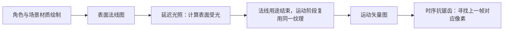

> 由 astra 生成 · 首次发布于 2026-09-27 18:44 · 最近整理于 2026-09-28 20:56（北京时间）

分析日期：2026-09-27。分析木偶的身体、脸、眼、裙装和袜子，以及角色从雪城场景取得环境颜色/阴影反馈的方式。

本文独立展开角色实现。公共光照、反射、雾和整帧后处理见 [原神场景分析](/2026/09/27/genshin-scene/)；完成单游戏分析后的横向结论见 [角色实现对比](/2026/09/27/character-comparison/)。

<!-- more -->

配图直接来自真实回放，关键效果用同一区域的阶段前后图解释。局部图已统一到便于阅读的方向，HDR 配对使用一致显示范围；最终画面另作外观参照。公式和通道按实际读写解释，未确认的部件归属明确保留。

## 1. 共用角色基础数据，按部件组合不同算法

| 部件 | 已还原的计算职责 | 与公共路径的联系 |
|---|---|---|
| 脸 | 把光方向投影到局部轴，以 SDF 控制明暗；通过 UV 图集叠加表情 | 同时输出公共法线、材质颜色与类别，详见第 5–6 节 |
| 眼睛 | 根据视角沿解析瞳孔深度轮廓推进，重建 UV；叠加多层纹理与 Matcap | 使用区别于身体的模板分类，详见第 8 节 |
| 裙装/衣料 | 从屏幕导数建立局部切线，组合基础与细节法线，按控制图选择参数组 | 与身体共用输出目标，但局部表面响应可不同 |
| 身体/袜子 | 写入表面方向、处理后的颜色及材质/时序分类 | 后续延迟光照、环境采样和抗锯齿按这些语义读取 |
| 头发与其他变体 | 保留独立像素着色路径 | 完整局部公式尚未全部还原，不由变体名称推断透射或各向异性模型 |

顶点处理与像素材质不是一一绑定：不同部件可以共享几何准备，却使用不同的法线、颜色和控制图求值。因此组合关系应由输入输出定义，不能只按某个顶点程序的资产名称分类。

## 2. 公共材质接口与眼睛分类

身体、脸、裙子、眼睛和袜子共用以下表面数据接口；部件差异通过通道内容和分类表达：

| 实际用途 | 在这一阶段保存什么 | 谁读取、用来做什么 | 编码格式 |
|---|---|---|---|
| **表面法线图 → 后续复用为运动矢量图** | 材质阶段 RGB 保存映射到 0–1 的表面方向；光照完成后改写，RG 保存前后帧屏幕位移编码 | 光照阶段读取法线计算受光；后续时序抗锯齿读取运动矢量定位历史像素 | RGB10A2 UNORM |
| **材质颜色图** | 场景表面颜色、角色已经过材质处理的颜色；alpha 另存材质标量 | 延迟着色组合受光与颜色；环境光传感器也采样此图 | RGBA8 sRGB |
| **角色辅助着色与材质参数图** | 角色分支保存另一组经处理的颜色/控制参数，不是全局统一的法线图 | 分类后的延迟着色使用；各材质通道意义不同，尚未全部还原 | RGBA8 sRGB |
| **材质类别与时序控制图** | 编码的材质类别及控制位；袜子分支直接写入类别值 5/255 | 延迟光照选分支，空间抗锯齿筛选类别，时序阶段提取高位控制信息 | R8 |
| **附加材质标量图** | 单通道材质控制量，与其他材质通道共同参与光照；未证实统一等于粗糙度或 AO | 分类后的延迟着色读取该量调整材质计算 | R8 |
| **打包材质扩展标记图** | 多个位域；袜子分支写入材质常量低四位，部分光照分支读取高四位；效果阶段继续写入 | 承载材质/效果控制信息，具体各位的业务名称尚待确认 | R8 |
| **相机深度与模板分类图** | 深度保存可见表面的远近；stencil 保存身体/眼睛等绘制分类 | 遮挡测试、位置重建与按类别处理光照 | D32S8 |

这里必须按**时间段**命名。把第一张纹理笼统叫“时序数据”没有解释用途；把它在角色材质阶段直接叫“运动矢量图”也不准确，因为这时真正写入的是法线。后面的运动绘制才改变它的含义。



运动写入程序计算当前/前一帧的屏幕坐标差，以有符号平方根压缩位移。时序阶段使用相反解码：`q = 编码RG - 0.498039216`，`位移 = sign(q) × (2q)²`，`历史UV = 当前UV - 位移`。因此它保存的是**屏幕空间运动矢量**，不是骨骼位移、世界空间速度或法线。原始写入、解码及阶段绑定见 [语义证据](/2026/09/27/scene-capture-comparison-resource-semantics/)。

这些表面图由所有可见角色与场景共同写入，像素分类决定如何解读；它们属于整帧接口，角色实例只负责自己覆盖的部分。

主材质通过深度测试后写入深度与模板分类，直接覆盖自己的表面数据。身体/脸/裙子/袜子的分类为 **0x85**，眼睛为 **0xA5**，两者相差 bit 5。后续延迟光照使用带掩码的 stencil 比较，因此不能把角色所有部件压成一个统一分类。

## 3. 角色环境光采样：先消费已有结果，再更新

| 处理 | 读取什么 | 产生什么 |
|---|---|---|
| 阴影环境采样 | 场景阴影图集（4096×2048 R16） | 角色环境采样中间图，70×5 RGBA16F |
| 材质环境采样 | 材质类别图与材质颜色图 | 更新同一角色环境采样中间图 |
| 环境结果汇总 | 已有环境汇总图 + 当前采样中间图 | 更新后的角色环境光结果图，70×1 RGBA16F |

中间图的每列保存五个空间采样点，汇总后每列压成一个反馈值。颜色采样与阴影采样分区存储并采用不同的更新公式，具体布局见第 7 节。

一个重要的顺序事实是：**身体、脸、裙子和眼睛的顶点程序先读取已有角色环境光结果图，环境汇总阶段随后才更新它。** 因而较早绘制读取的是写入前的内容，不可能读取尚未执行的本帧后续结果。本次已从指令与常量还原平滑公式和分区布局，见第 7 节；每帧交换方式、更新频率和槽位分配仍需连续帧确认。

环境反馈是按材质路径选择性消费的输入：本帧袜子顶点路径没有读取它，不能假定每个部件都会应用同样的环境结果。

## 4. 阴影与运动阶段会再次提交角色

角色/人群参与 2048² 的角色阴影深度图，另有与场景几何共用的阴影路径。阴影深度用于判断光线到达表面之前是否被遮挡；完整图集、区块边界和烘焙解压见 [原神场景分析](/2026/09/27/genshin-scene/)。

相机与几何运动路径会再次处理角色部件。它需要当前与前一帧变形后的位置来计算屏幕位移，因此骨骼/形态动画不能只更新当前颜色用的位置；否则画面形状变了，历史重投影仍会沿旧运动取样。

最终公共抗锯齿读取运动矢量图和材质类别图，且边缘阶段对约 `5/255` 的类别值做专门检查。这里的 R8 分类纹理与深度附件中的 stencil 是两个不同存储接口，不能把 `0x85/0xA5` 直接解释成类别图里的值。

## 5. 脸部 SDF：方向投影、左右镜像与双通道阈值

这次继续追踪后，已经能确认脸部实际采样脸部 SDF，不能再只停留于“有一张名字叫 SDF 的贴图”。顶点阶段先把光方向投影到模型局部轴，并分别在两个二维平面内归一化，生成传给像素阶段的方向参数；分母下限为 **0.0001**，避免方向几乎垂直于该平面时除零。

主 SDF 分支包括四步：

1. 根据局部方向的符号决定是否把脸部 UV 的 U 改为 `1-U`；另有材质参数强制镜像或强制不镜像。
2. 读取 SDF 贴图的 R 与 A。若 A 大于 **0.0001**，取 `(A+1)/2`；否则取 `R/2`，将两个编码区间接为一个阈值量。
3. 根据局部光方向计算比较阈值，并限制在材质给定范围内。
4. 对“采样值减阈值”做可调陡度的 S 形过渡，得到用于亮暗分区的系数。

脸部 的主公式可写为：

```text
采样阈值 = (SDF.a > 0.0001) ? 0.5 * (SDF.a + 1) : 0.5 * SDF.r
方向阈值 = clamp(0.5 - 0.5 * 局部方向项 + 阈值偏移, 阈值下限, 阈值上限)
差值 = (采样阈值 - 方向阈值) * 边界陡度
指数项 = exp2(-49.828922 * abs(差值))
亮侧系数 = 差值 >= 0 ? 1/(1+指数项) : 指数项/(1+指数项)
结果 = lerp(暗端系数, 亮端系数, 亮侧系数)
```

| 本帧脸部参数 | 实际值 | 意义 |
|---|---:|---|
| 镜像覆盖控制 | -1 | 此次主 SDF 分支强制不镜像，覆盖方向自动判定 |
| 阈值偏移 | 0 | 不额外平移主分界线 |
| 边界陡度 | 100 | 主亮暗边界非常陡；不是固定宽度的 Lambert 半角过渡 |
| 阈值下限 / 上限 | 0.03 / 0.97 | 防止方向阈值到端点后整个脸瞬间落入单一侧 |
| 暗端 / 亮端 | 0 / 1 | 主系数覆盖完整区间 |
| 次级 SDF 分支开关 | 1 | 程序还执行另一组 UV/方向驱动的形状控制 |

次级分支会使用 SDF 的另外两个分量，在特定 UV 分界处选择缩放、偏移和周期重映射，再将两个平滑条件组合成带状/局部控制量。这部分不能直接约化为“同一 SDF 再采样一次”，它可以独立塑造脸上的局部明暗或附加项。

脸部最终还叠加阴影色、按材质区域选择的高光参数、视角相关边缘项等，所以 SDF 系数并非完整最终颜色。证据：[脸部像素程序](/scene-capture-comparison/muou/shaders/ResourceId_75686.ps.txt)、[局部光方向生成](/scene-capture-comparison/muou/shaders/ResourceId_64868.vs.txt)、[本帧脸部常量](/scene-capture-comparison/muou/implementation-details/e10433_ps_s0_b0.bin)。

## 6. 表情不是只有骨骼：UV 图集、旋转与双层贴图混合

同一脸部程序还包含表情贴图路径。它把表情索引除以图集列数，分别用商/余数确定图集的行列；行方向会反序。表情 UV 在进入图集之前可执行：

- 以 `(0.5,0.5)` 为中心平移；左右脸可以选择不同偏移/缩放，并可镜像 U。
- 用 `sin/cos` 构建二维旋转；角度可含时间速度项。
- 将变换后的局部 UV 限制在 0–1，再缩放到图集单元并加行列偏移。
- 可选地采样第二个表情单元，以第二样本 alpha 混到第一样本上。
- 最后以表情 alpha 覆盖脸部颜色，并根据光方向控制表情颜色受到的阴影影响。

它实际绑定的是眼部/表情混合贴图。这说明表情显示可以由材质参数切图、UV 变换与几何变形共同完成；仅恢复骨骼和 BlendShape 仍可能缺失表情。

程序另有 **4×4 有序抖动消隐**。本帧矩阵为：

```text
 1  13   4  16
 9   5  12   8
 3  15   2  14
11   7  10   6
```

当有效消隐量小于 0.95 时，用屏幕像素位置选矩阵项，并依据 `17×消隐量 - 矩阵项 - 0.01` 决定丢弃。它保持不透明材质的深度行为，同时在空间上模拟渐隐，和给整张角色颜色做 alpha 混合不同。是否触发要看本次材质参数与像素输入，不能把程序内存在的消隐能力视为所有部件每帧均在渐隐。

## 7. 角色环境采样的实际布局：10 组环境颜色 + 60 组阴影

70×5 的中间图并非同质的 70 个角色条目。本帧顶点变换将它分成**10 列环境颜色区**与**60 列阴影区**，每列有 5 个采样点；对应常量分别提供 50 与 300 个采样位置。输出的 70×1 汇总图保持相同分区。

| 路径 | 采样点如何处理 | 中间图内容 | 汇总方式 |
|---|---|---|---|
| 60 组阴影采样 | 根据采样位置相对四个阴影覆盖中心的距离选择级联，变换到阴影坐标后做比较采样 | R=`1-阴影通过率`，A 为该采样点的有效性/控制量，其余通道为零 | 只纳入 A>0.001 的点；汇总到一个阴影状态对 |
| 10 组环境颜色采样 | 把世界采样位置投影到主视图，读取材质颜色与类别 | RGB 为场景材质颜色，A 为有效性；材质类别 4、5 被排除 | 对有效点取 RGB 均值，再和已有颜色结果插值 |

排除类别 4、5 是实际整数分类判断，不是按“像素看起来像皮肤”筛选。这样可以避免某些角色类像素反过来主导自己的环境采样；类别与角色的完整业务对应仍以生产者为准。

环境颜色的历史更新在本帧为：

`新环境颜色 = 0.9 × 旧环境颜色 + 0.1 × 当前有效采样均值`。

没有有效采样时，当前值回退为旧值。由 0.1 系数可推得：对固定的新环境输入，旧结果残留比例为 `0.9^帧数`，约 **7 次更新衰减一半，22 次更新完成约 90% 的变化**。这是从系数推导的收敛特性，不是额外采集的时间测量。

阴影区使用不同的非线性状态更新。用语义变量表示其主体：

```text
阴影偏差 = 最后有效控制量 * (有效阴影均值 - 0.5)
旧偏差状态 = 旧状态.y - 0.5
响应增益 = pow(1.001 - abs(旧偏差状态), 10) + 0.01
新偏差状态 = 旧偏差状态 + 阴影偏差 * 响应增益
新状态.x = saturate(旧状态.x + 新偏差状态)
新状态.y = saturate(新偏差状态 + 0.5)
```

控制量大于 999 时走强制覆盖分支，两个输出分量直接用当前偏差的饱和值。该路径不是 RGB 环境颜色用的固定 0.1 插值。两种结果共用小纹理，但布局、有效性与更新规则不同，移植时必须分别处理。

证据：[阴影点采样](/scene-capture-comparison/muou/shaders/ResourceId_41082.ps.txt)、[环境颜色点采样](/scene-capture-comparison/muou/shaders/ResourceId_41083.ps.txt)、[阴影状态汇总](/scene-capture-comparison/muou/shaders/ResourceId_41085.ps.txt)、[颜色历史更新](/scene-capture-comparison/muou/shaders/ResourceId_41086.ps.txt)、[补充回放常量记录](/scene-capture-comparison/muou/implementation-details/details.json)。

## 8. 眼睛与衣料：有解析视差、视角高光和多层材质控制

| 眼睛材质写入之前 | 眼睛材质写入之后 | 最终脸部效果 |
|---|---|---|
|  |  |  |

**观察眼白中蓝色虹膜与内部亮部的出现。** 前两图是同一材质颜色目标的相邻阶段，直接显示眼睛程序写入的内容；头发等后续部件尚未完全覆盖，所以前额与最终图不同。第三图展示最终组合效果。解析视差随视角变化的幅度仍需多视角验证，不能由这组三张静止图单独证明。

**眼睛的视差不是简单平移 UV。** 程序以眼睛表面法线、相机方向和材质参考轴建立局部坐标系，根据视角决定步数：

`步数 = ceil(16 - 12 × abs(法线与视线的点积))`，即正视约 4 步、掠视最多约 16 步。

它沿局部视线在 UV 平面推进，使用瞳孔中心到当前 UV 的半径构造解析深度轮廓，找到穿越点后用前后两步插值细化，再采样瞳孔底色。该轮廓由半径和幂指数控制，主循环里并未逐步采样高度纹理；不能把它写成标准高度图 POM 的固定采样版本。

本帧瞳孔中心为 **(0.5,0.5)**，半径参数 **0.5**，视差幅度参数约 **0.3**，径向轮廓指数为 **2**。执行范围还受几何传入的眼部标记限制，这些步数是该分支的上限，不表示眼睛所有像素必定做 16 次循环。

眼睛还具备以下可直接追踪的材质机制：

- 多层瞳孔纹理各有独立 UV 移动/旋转/振荡；额外混合 ramp 使用固定行坐标 **0.875、0.625、0.375**，一张贴图容纳多个混合曲线。
- 将 UV 相对中心的位置还原为球面方向，第三分量由 `sqrt(max(0,1-x²-y²))` 得到；再和原法线混合。本帧该混合强度约 **0.3**。
- 将这个方向转到观察空间并映射到 0–1 采样 Matcap，形成随视角改变的眼球亮部/高光。Matcap 的亮度阈值、颜色缩放和叠加强度可单独调节。
- 不同分支支持加法、乘法和类似叠加模式的颜色混合；部分路径以三次多项式 `((0.305306×c+0.682171)×c+0.012523)×c` 转换颜色，不是统一对所有层直接做线性相加。


**观察浅色裙片、深色褶边和金色包边。** 局部图用于定位下面讨论的材质分区及其明暗外观；具体法线和参数组如何选择，由材质程序的控制图与阈值确定。

**木偶裙装也不只是套一个通用 toon ramp。** 程序从位置与 UV 的屏幕导数建立局部切线方向，读取身体法线贴图，再叠加衣料细节法线；细节 XY 由贴图映射到 [-1,1]，Z 按 `sqrt(1-min(dot(XY,XY),1))` 重建。部分细节路径受材质区域标志控制，避免对全部身体使用同样织物微法线。

裙装实际同时绑定身体底色、材质控制图、基础法线、细节图、金属响应图、高光 ramp 和阴影 ramp。控制图 alpha 通过 **0.2、0.4、0.6、0.8** 等阈值选择不同材质参数组；法线与光方向点积先映射为 `0.4975×N·L+0.5`，再与控制图及顶点量结合决定明暗分区。因此“同一件服装”的不同区域可以拥有不同阴影色、高光和细节响应。

另一个值得保留的事实是，细节纹理的资源名来自另一角色的袜子资产，但本次确实绑定给木偶裙装使用；名称不能替代实际绑定关系。各层是否产生贡献应结合当前开关和采样值，本文不把所有编译分支都说成同时生效。

证据：[眼睛程序](/scene-capture-comparison/muou/shaders/ResourceId_75690.ps.txt)、[眼睛本帧参数](/scene-capture-comparison/muou/implementation-details/e10567_ps_s0_b0.bin)、[裙装程序](/scene-capture-comparison/muou/shaders/ResourceId_75688.ps.txt)、[裙装本帧参数](/scene-capture-comparison/muou/implementation-details/e10491_ps_s0_b0.bin)。

## 9. 分析边界与证据

脸部 SDF、表情路径、解析瞳孔视差、衣料细节和环境采样已拆到计算规则；头发/晶体等其他变体的完整公式、每个网格的蒙皮分工以及环境槽位到角色的分配仍待确认。传感器更新公式可由本帧程序确定，跨帧交换与实际更新频率仍需连续帧。

[角色绑定证据](/2026/09/27/scene-capture-comparison-character-binding-details/) 保存原始状态，[资源语义索引](/2026/09/27/scene-capture-comparison-resource-semantics/) 对照数据用途；捕获编号和提交统计只用于附录定位。
