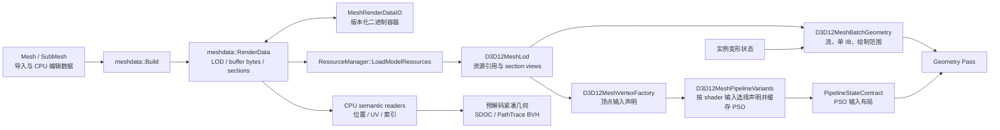

> 由 astra 生成 · 首次发布于 2026-09-27 18:44 · 最近整理于 2026-09-28 20:56（北京时间）

本次改造建立了普通模型与逆向角色共享的网格渲染数据流。参考本地 `UE 5.7.4 源码目录` 的 UE 5.7.4 源码，将导入数据、GPU 数据布局、顶点输入声明与绘制范围分开。自定义角色的数据边界见 `Docs/character-render-data-flow.md`。本说明不代表已经实现 UE 的完整 Vertex Factory 系统、GPU Scene 或 Mesh Draw Command 缓存。

## 1. UE 的职责划分

以下位置相对于 `UE 5.7.4 源码目录/Engine/Source/Runtime`，行号对应本次阅读的本地源码。

<!-- more -->

| 职责 | UE 实现位置 | 对 Peanut 的启示 |
|---|---|---|
| 静态网格源数据与渲染数据 | `Engine/Classes/Engine/StaticMesh.h:623` 的 `RenderData`；`:647` 的 `SourceModels`；`:1608` 的 `GetMeshDescription` | 导入、编辑使用的数据不必等于 GPU 内存布局 |
| 骨骼网格源数据与渲染数据 | `Engine/Classes/Engine/SkeletalMesh.h:463` 的 `ImportedModel` 与 `:468` 的 `SkeletalMeshRenderData` | 构建过程产生独立的渲染产物，避免让渲染 Pass 解释源资产格式 |
| LOD 顶点与索引资源 | `Engine/Public/StaticMeshResources.h:319` 的 `FStaticMeshVertexBuffers`；`:425` 的 `FStaticMeshLODResources` | Position、Tangent/UV、Color 可以独立存储；资源可由多个 section 共享 |
| Section 范围 | `Engine/Public/StaticMeshResources.h:201`；`Engine/Public/Rendering/SkeletalMeshLODRenderData.h:27` | section 保存材质、索引范围与顶点范围，不要求每个 section 独占一对 VB/IB |
| 顶点取数规则 | `RenderCore/Public/VertexStreamComponent.h:21`；`RenderCore/Public/VertexFactory.h:796` | 流起点、属性偏移、格式、步长与使用方式是独立字段 |
| Pass 的顶点输入 | `Renderer/Public/MeshPassProcessor.inl:87`、`:92`、`:118` | 从同一个 Vertex Factory 获取 declaration 和 streams，确保 PSO 与实际绑定一致 |
| 绘制描述 | `Engine/Public/MeshBatch.h:231` 的 `FMeshBatchElement` 与 `:370` 的 `FMeshBatch` | 将材质、Vertex Factory、索引范围、实例参数组合成 draw 描述 |
| 最终命令与生命周期 | `Renderer/Public/MeshPassProcessor.h:1214` | `FMeshDrawCommand` 持绘制所需状态，但不负责其引用资源的生命周期 |
| 实例变形流 | `Engine/Private/GPUSkinVertexFactory.cpp:1505`、`:1518`、`:1573` | 通过运行时覆盖 current/previous position、tangent 等输入，保持静态渲染资产不变 |

UE 的 `FStaticMeshVertexBuffers` 包含位置、静态属性、颜色等 buffer；骨骼网格还持有 skin weights、cloth、morph 等渲染资源。它没有要求所有资产都使用一个不断扩大的 C++ `Vertex` 结构。

`FVertexFactory::AccessStreamComponent` 根据 buffer、stride、stream offset 和 usage 合并相同流，再生成属性声明。一个 buffer 可以提供多个属性；也可以在不同绑定中使用不同范围。Peanut 当前通过显式 `inputSlot` 表达这些关系，不实现 UE 的全部自动组流机制。

### 多路 VB 与一个 IB

一次 indexed draw 可以绑定多路顶点输入，每路提供不同属性。该 draw 只绑定一个 index buffer；取出的 index 加上 `baseVertex` 后，用来访问所有按顶点推进的流。按实例推进的流使用实例索引规则，stride 为零的流提供常量记录。

UE 可以为一个 LOD 保存普通、depth-only、反绕序、wireframe 等多份 IB，但单次 draw 从中选择一份。资产可拥有多份 IB，不等于同一次 draw 并行绑定多份 IB。

## 2. Peanut 的数据流



核心接口如下：

| 层 | 文件 | 责任 |
|---|---|---|
| 源数据 | `Peanut/src/Resource/Mesh.h` | 加载器的顶点、索引、材质、节点及 CPU 查询数据 |
| 渲染数据 | `Peanut/src/Resource/MeshRenderData.h/.cpp` | 与 D3D12 无关的格式、字节载荷、流、属性声明、section、LOD；构建与校验 |
| 渲染容器 | `Peanut/src/Resource/MeshRenderDataIO.h/.cpp` | 有版本的序列化与反序列化，失败不替换已有数据 |
| D3D12 适配 | `Peanut/src/Renderer/D3D12MeshRenderData.h/.cpp` | 格式转换、vertex declaration、GPU views、几何 batch |
| GPU 上传 | `Peanut/src/Renderer/ResourceManager.cpp` | 按 RenderData buffer 列表上传，不通过源 `Vertex` 推断 buffer 排布 |
| 渲染 Primitive | `Peanut/src/Renderer/RenderPrimitive.h` | geometry 所有权、实例状态与变形后的 batch 选择 |
| Pipeline 契约 | `Peanut/src/Graphic/Pipeline/ShaderLayoutArtifact.h/.cpp` | 顶点声明与其他 PSO 状态的持久化及稳定哈希 |
| PSO 重建 | `Peanut/src/Renderer/Pipeline/D3D12PipelineStateArtifact.h/.cpp` | 从契约生成 D3D12 input layout，维护 semantic 字符串生命周期 |
| 布局 PSO 变体 | `Peanut/src/Renderer/Pipeline/D3D12MeshPipelineVariants.h/.cpp` | 用 shader 输入签名筛选 section 声明、生成与缓存 PSO，随 runtime generation 退休 |

`D3D12MeshBatchGeometry` 当前只描述几何输入与 draw 参数。它不是 UE `FMeshBatch` 的完整替代：材质绑定、程序选择、RenderGraph 参数仍使用现有 Pipeline/Pass 系统。后续可以将这些内容汇合到 draw packet，不能仅凭类名认为完整的 draw command 缓存已经完成。

## 3. RenderData 契约

`meshdata::RenderData` 包含多个 `Lod`；每个 LOD 有 buffer 载荷列表和 section 列表。Buffer 的编号表示存储资源，`inputSlot` 表示顶点输入槽，二者不要求相等。

一个 `Section` 包含：

- `streams`：每路流的 `inputSlot`、`bufferIndex`、`byteOffset`、`byteSize`、`byteStride`。
- `attributes`：semantic 名称及序号、格式、所属槽、记录内属性偏移、per-instance 分类与 step rate。
- `indices`：唯一的索引流，含 buffer 编号、字节范围与 UInt16/UInt32 格式。
- `indexCount`、`firstIndex`、有符号 `baseVertex`：直接对应 indexed draw 的范围。
- `vertexCount`：应用 base vertex 后可访问的顶点数量上限。
- `materialName` 与 `sourceSubmesh`：材质和源数据映射；源映射不能被当作 GPU buffer 编号。

三个偏移不能混用：

```text
vertexAddress = vertexBufferBase + stream.byteOffset
              + vertexIndex * stream.byteStride + attribute.byteOffset

indexAddress  = indexBufferBase + indices.byteOffset
              + (firstIndex + drawIndex) * indexElementSize

vertexIndex   = decodedIndex + baseVertex
```

`byteSize` 是绑定 view 的范围。`firstIndex` 是相对该 index view 的元素偏移，不是字节偏移。stride 为零时所有顶点访问同一记录，仍必须检查该记录足以容纳属性。

当前属性格式覆盖 Float1/2/3/4、Half2/4、UNorm8x4、UInt16x4、UInt32x4。该集合有明确边界，不表示已支持所有 DXGI 顶点格式。增加格式时应同时更新格式宽度、D3D12 映射、容器兼容性与测试。

`meshdata::Validate` 在上传前检查流引用、字节范围、重复 semantic、槽内 classification 一致性、属性宽度、索引对齐、draw 索引范围以及 `index + baseVertex`。实例流所需的记录数还取决于实际 draw 的实例参数，不能仅靠资产验证代替 draw 层验证。

二进制容器使用 `PNMRDATA` 标识与 `RenderDataFileVersion`，结构字段显式按 little-endian 编码。Buffer payload 保留其指定 GPU 格式的原始字节，容器不会替调用者转换顶点格式。成功解码后才发布结果；未知版本、截断数据或非法范围应失败。

## 4. GPU 所有权与实例覆盖

| 对象 | 持有内容 | 生命周期要求 |
|---|---|---|
| `meshdata::RenderData` | CPU 渲染载荷与布局元数据 | 上传、验证及可能的缓存需要；不是运行时姿态容器 |
| `RenderPrimitive::geometryArena` | 实际 DEFAULT GPU buffer | 与 geometry 一同创建和退休，不随实例增删重建 |
| `D3D12MeshLod` | arena 内资源的非拥有引用、resource state、section views | arena 有效期间才可使用 |
| `D3D12MeshBatchGeometry` | 本次 draw 的 VBV/IBV 与范围副本 | 不延长 GPU 资源生命周期 |
| 实例变形资源 | morph 输出、骨骼矩阵、姿态版本等 | 属于实例；不能改写共享静态资产来表达某一实例的姿态 |

Geometry 上传应使用空 staging arena，完整构造后再发布。失败时不能留下可被 Pass 读取的半成品。替换旧 geometry 时，还必须遵守现有 GPU fence/idle 约束；复制了 VBV/IBV 不意味着原资源可以提前销毁。

同一 section 的绘制输入通过 `SelectMeshBatch` 一类统一入口选择。启用且版本有效的 GPU morph 输出覆盖对应顶点流；其余流、索引和 section 范围沿用静态 geometry。各 Pass 不应独立判断变形是否有效，否则主视图、阴影和选中轮廓会读取不同姿态。

CPU fallback 也使用实例独立的 `cpuMorphArena`，按 `sourceSubmesh` 选择输出，只有版本
与当前 morph 权重一致时才绑定。CPU 输出和上传资源在首次需要时分配；上传缓冲按
frame slot 分片，并在该 slot 的 fence 等待结束后填充，避免覆盖前帧仍在读取的字节。
CPU/GPU 两条路径都不写回静态 geometry。

当前拆流资产的 CPU/GPU morph 输出均为每顶点 12 字节的 float3 position，仅覆盖 slot 0；surface、color、skin 及索引继续引用静态 geometry。旧 Interleaved 资产继续输出完整 120-byte `Vertex`，两种路径都按布局、源顶点顺序和版本检查后才允许绑定。

GPU morph 的共享基础输入仍采用 canonical 120-byte `Vertex`，便于同一 MMD 资产在不同渲染布局的 entry 间共享；compute 根据输出 stride 选择写入 position 或完整记录。因此本轮降低的是拆流资产的变形输出、CPU 上传和对应读取量，不能把它描述为消除了所有 120-byte 基础存储。变形 tangent/normal 与 previous-frame position 尚未实现。

## 5. Declaration 与 PSO 必须一致

绑定多路 VB 只是输入的一半。PSO 的 input layout 决定 shader 从哪个槽、什么格式、哪个记录偏移读取每个 semantic。因此 shader、declaration 和实际 streams 必须形成同一份可验证契约。

`D3D12MeshVertexFactory::Compile` 将渲染属性转成 `PipelineVertexAttributeContract`。现有 Pipeline 契约已经覆盖：

```text
semanticName / semanticIndex / format / inputSlot /
alignedByteOffset / inputClassification / instanceStepRate
```

这些字段参与 PSO 契约哈希。GPU 地址不属于 PSO identity；VBV 的地址、大小和 stride 是 draw 绑定状态。布局相同、资源地址不同的网格可以复用 PSO。布局变化必须选择或创建相应 PSO，不能只更换 VBV。

需要维持以下规则：

1. 通用路径从渲染数据产生声明，并按当前 shader 的输入签名选择声明中的属性，生成相应 PSO。
2. 缺少 shader 输入或数据类型不兼容时拒绝创建变体。不同槽位与记录偏移通过 PSO 变体表达，不将缺失 semantic 静默指向 POSITION。
3. 某个 shader 只使用一部分属性时，按该 shader 的输入需求验证；不要求它消费资产的所有属性。
4. geometry 或 declaration 更新后，依赖旧数据的 draw packet 必须失效；仅更新 material revision 不足以覆盖这类变化。
5. 标准布局的特殊 shader alias 应集中在明确的适配层，不能反向污染通用资产声明。

`D3D12MeshPipelineVariants` 已接入 PBR、Forward 与 Shadow 的标准几何路径。它反射 vertex shader 的非 system-value 输入，按 semantic 匹配 section 声明，并检查分量类型与数量。shader 不消费的额外属性不进入有效 input layout；布局相同但 GPU 地址不同的模型可以复用 PSO。支持范围受 RenderData 格式和 shader 输入约束限制，不等于任意捕获布局均能直接适配。

缓存由 runtime program generation 持有，保存该代的 shader bytecode、root signature、基础管线契约及布局变体。布局 identity 命中后还比较完整声明，避免仅凭哈希混淆；有效 input layout 和完整契约相同的变体复用 PSO。热重载在 staging generation 中预热上一代已成功使用的布局，任一变体重建失败都拒绝发布新代，保留旧 shader/PSO 及其缓存。Forward 的独立 reload staging 遵循相同规则。

## 6. 默认拆流 build 与兼容策略

第一阶段先建立显式 RenderData、共享 view 和 batch 消费接口，采用 120-byte 单流兼容现有加载器。本轮 `meshdata::Build(mesh)` 默认使用 `VertexLayout::SplitStreams`；源 `Mesh::Vertex` 仍为 120 字节，render build 将其无损拆成四路：

| Slot | 属性及记录内字节偏移 | 普通 stride |
|---|---|---:|
| 0 | POSITION Float3 @ 0 | 12 |
| 1 | NORMAL Float3 @ 0、TANGENT Float4 @ 12、TEXCOORD0/1/2/3 Float2 @ 28/36/44/52 | 60 |
| 2 | COLOR Float4 @ 0 | 16 |
| 3 | BLENDINDICES UInt32x4 @ 0、BLENDWEIGHT Float4 @ 16 | 32 |

每个 LOD 共享四个 VB 池及一个 IB 池，section 通过 view offset/size 选择范围。buffer 资源数量不再随 section 数量按两倍增长。slot 1/2/3 的整个属性组在同一 section 内逐字节相同时只保存一条记录，使用 stride 0；不同 NaN payload 或正负零保持区别，不进行数值量化。Position 永远保留 stride 12，以提供一致的变形覆盖接口。各 section 的 IB 按实际最大索引选 UInt16 或 UInt32，在同一池中按元素宽度对齐；选择依据不是总顶点数量。默认 build 的 `firstIndex` 和 `baseVertex` 均为 0，非零 byteOffset 仍正常参与寻址。

`SplitVertexAttributes()` 提供拆流声明；`StandardVertexAttributes()` 继续提供旧声明。显式 `Build(mesh, VertexLayout::Interleaved)` 保留每 section 一条 120-byte 顶点流和 UInt32 索引。自定义 character profile 可使用 Interleaved，或通过 `renderData` 引用保留源 stream/IB 契约的 `.pnmesh`。两者进入 Pass 前都由同一个 `RenderPrimitive` 持有并使用同一套实例、节点、骨骼、morph 与可见性数据，再作为不可变帧提交的一部分交给 Pass。

空或非法 submesh 被拒绝，`sourceSubmesh` 与源列表保持一一对应。没有常量组时，四路顶点的总 payload 仍为每顶点 120 字节；实际节省来自常量组、16-bit IB、共享资源以及 position-only 变形输出。normal/tangent/UV 的量化压缩尚未实现，整体帧耗时收益需要实际场景测量。

## 7. CPU 源数据边界

`MeshRenderData` 已提供与 D3D12 无关的 `ReadVertexAttribute`、`ReadPosition`、`ReadTexCoord` 和 `ReadIndex`。reader 处理 view offset、stride 0、16/32 位索引、firstIndex/baseVertex，并检查范围；失败不修改输出。Position 支持 Float3/Float4/Half4，UV 支持 Float2/Half2，其他格式需要显式扩展解码策略，不能 reinterpret 成 `Vertex`。

CPU occlusion 的 SDOC 输入和 PathTrace BVH 已改为通过这些 reader 获取 RenderData 几何。准备阶段先解码每个被索引引用的顶点，并整理为紧凑位置/UV/索引缓存，再展开节点和实例；不会在每实例、每三角形遍历中重复查找 semantic。不能读取位置或索引的 section 不作为遮挡物；骨骼网格仍不使用 bind-pose 几何作为 SDOC 遮挡物。PathTrace 缺失或无法解码 UV 时使用零 UV 并报告该情况。

CPU picking 仍使用源 Mesh；节点、材质、bounds、骨架及 MMD 基础变形数据也仍由原资产提供。这一边界应在直接加载外部 RenderData 时显式处理，不能认为有通用 reader 就已取消所有 CPU 源数据依赖。

RenderData 文件也不取代完整场景资产：材质资产、节点树、骨架、动画和编辑器状态仍由现有资源及场景序列化系统负责。文件可以表达多个 LOD，但自动 LOD 选择、streaming 与资源退休尚需独立接线。

## 8. 后续阶段与验证边界

当前已接入默认拆流构建、共享 LOD 缓冲、直接/间接绘制、VF 驱动的标准 Pass PSO 变体、position-only 实例变形及 SDOC/PT 的 CPU 解码。后续工作包括：

1. 将 picking 等剩余 CPU 使用方迁移到明确的解码接口，完善外部 RenderData 与场景资产的接线。
2. 在测量基础上增加 normal/tangent/UV 等压缩策略，并同步 shader、CPU reader 和容器兼容性。
3. 扩展 tangent/normal 变形及 previous-frame 数据；随后实现自动 LOD 选择、streaming、跨模型共享 geometry 和对应缓存失效策略。
4. 新的逆向资产只增加精确 adjacent profile 与游戏专用 Pass/后处理图；不得增加平行的运行时场景状态路线。

`PeanutMeshRenderDataTests` 覆盖 RenderData 构建、校验及序列化层；本轮增加拆流后所有
semantic 的逐顶点逐字节保真、常量组、混合 16/32 位索引池与边界、half reader 和错误
范围检查。GPU 与编辑器回归范围包括拆流 PSO、直接/间接绘制、CPU/GPU position
morph 切换、shader reload 的变体预热及失败保留；最终结果在完成后另行记录。
`PeanutMeshRenderGpuTests` 使用真实 ResourceManager 和 WARP，覆盖共享 VB/IB、稀疏
slots、非零偏移、UInt16、firstIndex、负 baseVertex、Half/UNorm、stride 0；回读颜色并
要求直接绘制与 ExecuteIndirect 全图一致。它还覆盖声明不匹配、非法上传、实例容量和
CPU/GPU 变形版本选择。编辑器回归继续遵循加载场景、截图、读取 PNG 的闭环。

### 第一阶段验证记录（2026-09-19；不代表本轮全部验证已完成）

- Debug 全量构建成功；CTest 21/21 通过，包含 editor CLI smoke。
- WARP 多流测试中，直接绘制与 ExecuteIndirect 回读逐字节一致；D3D12 debug layer
  未报告 error/corruption。
- 编辑器加载 Cornell glTF、立方体 OBJ 并截图；立方体直接/间接绘制保持同一几何。
- `Gene_light.pmx` 加载 `01_happy.vmd`，固定第 15 帧并关闭物理后，GPU→CPU→GPU
  三张截图 RGB 逐像素相同；切至第 0 帧后差异仅位于脸部。连续 CPU 播放、暂停、
  重新加载立方体均完成。此 PMX 的 `light/` 贴图不在本地，使用默认材质验证几何和
  变形一致性，不作为材质还原验收。

### 默认拆流阶段验证记录（2026-09-19）

- Debug 全量构建成功；CTest 21/21 通过，包含 WARP GPU validation 与 editor CLI smoke。
- 同一 Builder 网格的 Interleaved 与 SplitStreams 输出在 WARP 上全图逐字节一致；
  直接绘制与 ExecuteIndirect 也保持一致，D3D12 debug layer 未报告 error/corruption。
- 生产 PSO 变体缓存跨 section/model 复用；缺失 semantic、错误数值类型或分量被拒绝。
  热重载预热失败保留旧 generation，成功路径的新旧 handle 均完成绘制。
- 真实 `MorphDeformer::DispatchFrame` 回读中，6 顶点 split 输出由 720 bytes 降到
  72 bytes；多 target 原子累加、权重归零与 CPU 参考逐字节一致，版本未变化时不 dispatch。
- `Gene.pmx` 的 PBR、CPU/GPU morph、Forward、归零和场景切换，与改造前对应截图
  RGB 逐像素一致；运行中 `shader.reload` 成功。Cornell 场景的 RenderData CPU reader
  完成 SDOC 查询与路径追踪截图。该轮新增日志没有 D3D12 error。
- 同一 Gene 场景的 arena requested bytes 从 17,554,668 降到 14,968,912，placed
  resources 从 35 降到 14；allocation bytes 从 19,333,120 降到 15,728,640。
  该数据包含场景的全部 placed-resource arena，只用于同场景前后对比。
- 兼容效果回归加载 Remielle、Azur Promilia 与 Marionette，并在 Remielle 场景中同时
  加载 SplitStreams 立方体。专用 profile 保持 Interleaved，布局没有串用；两套 profile
  均通过 `shader.reload`。回归发现并修复了 RenderGraph 将“depth 只读、stencil 可写”
  attachment 错判为 ReadDSV 的问题；修复后的整轮 D3D12 validation error 数为 0。
  Azur 现在与 Remielle 一样从 RenderGraph 读取实时 depth/GBuffer/motion/scene，并逐帧
  写入 instance、camera 和 directional-light 数据。固定截帧资源只由离线验证工具读取。
  Depth Rim、Fog、AO、
  TAA 与 DOF 已恢复实时 viewport、camera、depth-linearization 和 pass-dimension 参数；
  e2562/e2687 的 temporal history 以各自同阶段 current color 作无跨帧历史兜底，避免
  transparent、mobile-TAA 和 DOF 阶段之间互相混色。Azur profile 另以
  `engineToSourceAxis=(-1,1,1)` 统一转换编辑器 LH 世界与 capture RH 世界；node、instance、
  camera 和 directional light 不再各自使用隐式坐标约定。
