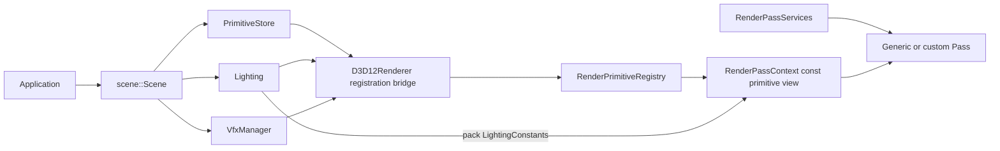

> 由 astra 生成 · 首次发布于 2026-09-27 18:44 · 最近整理于 2026-09-28 20:56（北京时间）

Peanut separates authored scene state from renderer-owned GPU proxies and from
the immutable data submitted to one frame. A render pass must not receive or
manage the logical scene.

| Layer | Peanut type | Responsibility |
|---|---|---|
| logical scene | `scene::Scene` | owns `PrimitiveStore`, `Lighting` and `VfxManager`; remains in the application layer |
| logical primitive | `scene::Primitive` | editable mesh state, stable IDs, source path and MMD runtime state |
| registration bridge | `D3D12Renderer` lifecycle functions | consume logical subsystems and create, update or retire GPU proxies; they do not receive the `Scene` aggregate |
| persistent render data | `RenderPrimitiveRegistry` / `RenderPrimitive` | GPU resources, instance buffers, deformation data and draw geometry |
| immutable frame submission | `RenderPassContext::primitives`, `lighting`, `viewHistory` | the exact primitive list, packed light constants and view data visible to one frame |
| pass capabilities | `RenderPassServices` | device, pipeline snapshot, camera and render settings; excludes scene load/edit/serialization APIs |
| pass-local draw data | `D3D12MeshBatchGeometry`, `CharacterDrawData` | draw inputs assembled from one submitted render primitive |

<!-- more -->

The equivalent Unreal Engine flow is `UWorld`/components into render-thread
proxies, followed by view construction and mesh draw commands. Unreal calls
its render-thread database `FScene`, but individual passes consume prepared
views, primitive arrays, light uniform buffers and draw commands. Peanut keeps
that database named `RenderPrimitiveRegistry` so the renderer does not expose a
second object that can be confused with the authored scene. `D3D12Renderer`
receives the logical primitive collection and lighting service separately, so
the rendering module cannot retain or expose the application `Scene` object.

`RenderPrimitive` represents one registered model proxy. It owns resources
whose lifetime follows renderer registration:

- immutable geometry arenas and mesh batch views;
- instances, node transforms and previous-frame transform history;
- skeleton and morph resources;
- material GPU resources and descriptor indices;
- culling, indirect draw and visibility buffers;
- the optional character render profile selected by the asset.

Before pass execution, `D3D12Renderer` publishes a stable list of
`const RenderPrimitive*` from the registry and packs logical lighting into
`LightingConstants`. Passes enumerate those proxies and translate the packed
frame data into a game-specific shader ABI. `RenderPassServices` replaces the
old full-renderer pointer, so scene load, model access, editing and
serialization are absent from the Pass type surface.

`scene::Lighting` stores logical lights only. Shader constant packing happens
at frame submission, and production code uses the `Lighting` instance owned by
the application `Scene`; there is no process-global lighting singleton.
`VfxManager` follows the same ownership rule. Particle passes receive only the
published emit count, active capacity and GPU buffers in `RenderPassContext`.

Character profiles customize pass selection, shader ABI, fixed state, MRT
layout and post-processing. Captured constants and textures remain immutable
profile assets and never form a second logical scene or runtime object graph.

The editor API retains names such as `AddSceneModel` because those operations
describe authored models. The renderer converts each registration into a
`RenderPrimitive`; internal rendering code must not call the proxy registry a
scene.
