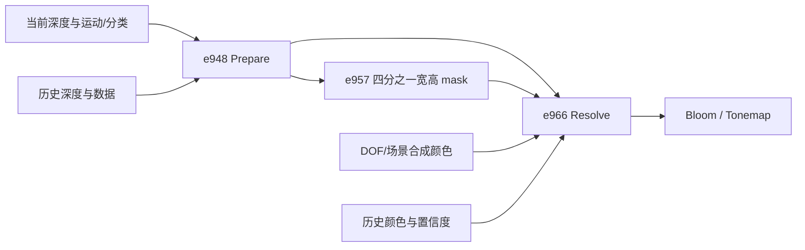
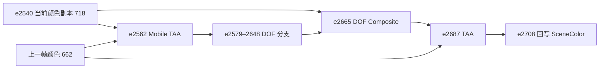
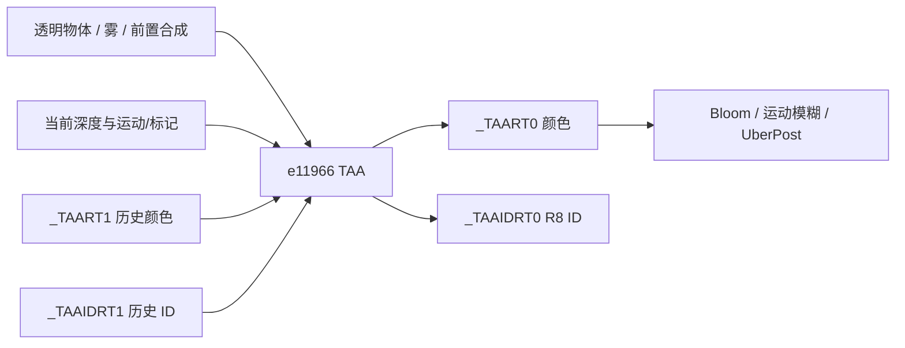

> 由 astra 生成 · 首次发布于 2026-09-27 18:44 · 最近整理于 2026-09-28 10:32（北京时间）

核验日期：2026-09-26。范围：终末地洛茜、蓝色星原洛洛、绝区零蕾米。按本次要求，不讨论原神的 FSR 管线。

<!-- more -->

本文比较**捕获帧实际执行的 shader、绑定资源和常量**，另列 Peanut 的运行时接入情况。它不是对这些游戏所有平台、画质档位或版本的概括。

## 1. 结论

目前需要区分四个算法阶段，而不是把三个游戏都归为同一个“TAA”：

- **洛茜**：三阶段处理，显式使用历史深度、历史运动/分类数据、低分辨率标记和颜色历史中的置信度；历史颜色采用五 tap 三次重建，颜色约束与融合也较复杂。
- **洛洛 Mobile TAA**：为后续景深分支提供时序处理后的颜色，使用少量邻域采样、RGB 范围限制和运动遮罩。
- **洛洛后段 TAA**：景深合成后的最终时序处理，使用压缩颜色域中的 3×3 YCoCg 方差裁剪，并按材质类别调整历史权重。
- **蕾米**：独立维护颜色历史和 TAA ID 历史；先检查 ID 是否匹配，再在压缩 RGB 域内裁剪历史，同时支持按像素标记回退到当前颜色。

以下公式用于解释差异，不是允许重新排列浮点运算的替换实现。需要无损替换时，应以捕获指令及已验证入口为准。

## 2. 一览

| 项目 | 洛茜 e948/e957/e966 | 洛洛 Mobile TAA e2562 | 洛洛 TAA e2687 | 蕾米 e11966 |
|---|---|---|---|---|
| 所处阶段 | DOF 和场景合成后，Bloom/Tonemap 前 | DOF 前，输出进入 DOF 分支 | DOF 合成后，后续 Para/Bloom/UberPost 前 | 透明物体、雾和前置合成后，Bloom/运动模糊/UberPost 前 |
| 本帧 TAA 分辨率 | 3440×1440；标记图为 860×360 | 3440×1440 | 3440×1440 | 3432×1440 |
| 深度邻域选择 | 4 次 Gather 取得 3×3 候选，择近 | 中心及四个对角候选，偏移约 ±2 texel | 邻域择近，必须保留捕获的非对称候选次序 | 中心及四个 ±1 pixel 对角候选，择近 |
| 运动解码 | 有符号四次方 | 有符号平方 | 有符号平方 | 有符号平方，但编码中心为约 0.498039 |
| 历史颜色采样 | 五 tap 十字形三次重建，另取一次线性样本作约束 | 单次双线性采样 | 单次双线性采样 | 单次双线性采样 |
| 历史颜色约束 | YCoCg 邻域统计、方差范围与置信度分支 | HDR RGB 的 min/max 加亮度差扩张，逐通道 clamp | 压缩颜色转 YCoCg，以均值/标准差构造盒，再沿方向裁剪 | 压缩 RGB 的亮度差扩张盒，沿方向裁剪 |
| 主要历史有效性信息 | 历史深度、运动差、分类/标志、遮挡显露标记、越界、置信度 | 历史运动遮罩及当前运动标记 | 当前材质类别、运动和历史 UV 越界 | 当前 TAA ID 与历史 TAA ID 差值、当前覆盖/分类标记 |
| 显式历史深度输入 | 有，供 Prepare 使用 | 无 | 无 | 无 |
| 历史颜色格式 | RGBA16F，alpha 有置信度含义 | R11G11B10F | R11G11B10F | R11G11B10F |
| 附加历史/标记 | R16F 深度、RGB10A2 数据；另有当前帧 R8 mask | 读取 R8 motion mask；本事件未绑定其第二颜色输出 | 读取当前材质标记；本事件未绑定其第二颜色输出 | 独立 R8 TAA ID 历史，第二 MRT 确实绑定 |
| 锐化 | e966 中未见独立的同类锐化强度分支；有邻域重建滤波 | 有，本帧系数 0.1 | 有，本帧系数 0 | 有，本帧系数 0.6 |

“无历史深度输入”不等于不做抗拖影：后三列依赖颜色裁剪、标记或 ID 拒绝，不能把它们写成显式的历史深度测试。

原始资源、格式、采样器、常量行和 shader SHA-256 汇总在 [capture-contracts.json](/public-doc-assets/taa-evidence/capture-contracts.json)。

## 3. 事件位置与数据流

### 3.1 洛茜



e948 输出 R16F 邻域深度和 RGB10A2 时序数据；e957 输出 860×360 R8 标记图；e966 输出 RGBA16F。标记图的宽、高各为原图的四分之一，像素数为十六分之一。

来源：[洛茜管线图](/2026/09/27/endfield-luoxi-rdc-pipeline-map/)、TemporalPrepare、TemporalMask、TemporalResolve。

### 3.2 洛洛：两个阶段与 DOF 的关系



这里有两个容易误读的地方：

1. **两个 TAA 阶段同读资源 662。** 截帧并没有证明它们各自拥有独立的颜色历史。e2562 读 `t3=662`；e2687 读 `t1=662`，最终写入另一张 `_TAATempRT_1`（666）。接入时需要保留这个共享历史契约。
2. **Mobile TAA 的输出进入 DOF 分支。** e2665 同时读取未经该阶段输出替换的当前颜色副本与 DOF 结果。因此，不能把它概括成“全画面无条件连续做两遍 TAA”。

两份 shader 都声明第二颜色输出，但捕获的 e2562/e2687 都只绑定一个 R11G11B10F 目标。声明 `SV_Target1` 不代表这一帧确实保存了遮罩；尤其不能据此为 e2562 凭空建立一个已证实的 mask 回写循环。

来源：[洛洛事件表](/2026/09/27/azur-promilia-rdc-pipeline-map/)、e2562 契约、e2687 契约。

### 3.3 蕾米



**e11948 不能计作第二次 TAA。** 它虽然同名 `Hidden/TemporalAntialiasing`，本次导出的 PS 只有一次纹理采样、RGB 输出和 alpha=1，没有历史输入或融合；应按前置采样复制/合成步骤理解。真正的历史融合是 e11966。

来源：[e11948 原始反汇编](/public-doc-assets/taa-evidence/remielle-11948.ps.asm.txt)、[e11966 原始反汇编](/public-doc-assets/taa-evidence/remielle-11966.ps.asm.txt)、[蕾米管线记录](/2026/09/27/zzz-remielle-rdc-pipeline-map/)。

## 4. 算法差异

### 4.1 运动向量不能直接互换

设纹理中的编码分量为 `e`，以下为捕获 shader 坐标系中的解码，尚未包含 Peanut 的 API 坐标转换：

| 实现 | 解码公式，逐分量 | 历史坐标 |
|---|---|---|
| 洛茜 | `q = 2e - 1; v = sign(e - 0.5) * q^4` | `uvHistory = uvOutput - v` |
| 洛洛两个阶段 | `q = 2e - 1; v = sign(q) * q^2` | `uvHistory = uv - v` |
| 蕾米 | `q = e - 0.498039216; v = sign(q) * (2q)^2` | `uvHistory = uv - v` |

蕾米的约 `0.498039216` 来自反汇编常量，不应随手改成 `0.5`。它还在 `cb0[167].x > 0.5` 时将运动归零；目前只确认分支行为，未确认原游戏给该开关起的名称。

这些运动纹理还携带不同的分类/覆盖信息。即使底层都使用 RGB10A2，也不能只按格式相同就共用解码器或 z/w 通道语义。

### 4.2 洛茜：显式时序验证与置信度

**Prepare（e948）** 从深度邻域择近，取相应运动/分类数据，重投影到上一帧；结合历史深度、前后运动差和分类变化生成 packed flags。深度差参与联合条件，不是一个孤立的“差值超过阈值便丢弃”的通用实现。**Mask（e957）** 汇总中心及对角采样的标记，供 Resolve 使用。

**Resolve（e966）** 的关键步骤：

1. 按当前采样偏移选择当前邻域，解码四次方运动并计算历史 UV。
2. 从 3×3 当前颜色构造亮度、YCoCg 统计、滤波颜色以及邻域连通性信息。
3. 用五 tap 十字形三次重建采样历史。采样过程中先按亮度压缩颜色；重建后还受一次线性历史颜色样本的约 `0.2×～1.8×` 范围限制。
4. 计算历史置信度，结合上一帧 alpha、当前 mask、分类、越界、运动和重置参数。强置信度分支可以放宽颜色裁剪。
5. 用邻域均值和标准差约束历史 YCoCg；裁剪尺度含 `1.25 - 0.7 * smoothstep(20, 40, deviation)`。最终融合在按亮度归一化的 YCoCg 域内完成，输出 alpha 保存新置信度。

洛茜使用的 YCoCg 数值为 `(R+2G+B, 2R-2B, -R+2G-B)`，与洛洛后段使用的四分之一缩放版本不同；对应阈值不能照搬。

本帧的 `historyBlendRange.zw ≈ (0.95, 0.85)` 只是基础权重。最终还会受历史采样位置、分类、拒绝标记和强置信度等分支影响，不能把整个 shader 简化成固定 `95% history + 5% current`。

### 4.3 洛洛 Mobile TAA：少量颜色采样与 motion mask

该阶段没有单独的 Prepare/Mask pass。它在当前深度的中心与四个较远对角候选中择近，取得运动，再完成以下处理：

- 当前颜色取中心及两个对角半 texel 的线性样本，形成滤波均值和锐化结果。
- 以两个邻居的 RGB min/max 为基础，按亮度差、运动大小和当前 `motion.z` 扩张范围，再对历史逐通道 clamp。没有洛洛后段的 3×3 YCoCg 方差统计。
- 历史颜色权重按运动插值。本帧为 `w = lerp(0.98, 0.80, saturate(6000 * length(v)))`。
- 在重投影位置及其两个半 texel 邻居读取历史 motion mask，取最小值；`motion.w == 1` 时清除此局部结果。
- shader 中的 mask 输出使用约 `0.618` 的插值；当历史 mask 大于 `0.5` 且当前 `motion.z == 0` 时，颜色回退到邻域平均。**本事件未绑定该 mask 输出，后续还需追踪资源 670 的真实写入者。**

本帧锐化系数为 `0.1`，亮度差扩张尺度随运动从 `4` 缩小到 `0.25`。颜色处理直接在 HDR RGB 上进行；这与蕾米在压缩 RGB 域中的范围限制并不相同。

来源：MobileTAA.hlsl。当前资产实际绑定 `PSCaptureValidation`，它调用 `EvaluateMobileTaa(input, +1)`。

### 4.4 洛洛后段 TAA：材质感知的方差裁剪

该阶段使用独立的 `TemporalAA.hlsl`。主流程为：

1. 从当前 UV 减去采样偏移；从邻域择近位置取得运动，求历史 UV。越界时回退当前颜色。
2. 用 `C / (1 + max(C.r, C.g, C.b))` 压缩当前与历史颜色，再将当前 3×3 邻域转到 YCoCg。
3. 计算 `mean` 与 `sigma = sqrt(abs(E[x²] - mean²))`，形成 `mean ± gamma * sigma` 的盒。将历史颜色沿盒中心到历史颜色的方向裁剪，保持分量之间的比例关系，而不是简单逐通道 clamp。
4. 按运动调整 `gamma` 和历史权重；材质类别为 **2、3、10** 时额外降低历史权重。
5. 将当前锐化颜色与裁剪后的历史混合，再反变换出 HDR 颜色。

本帧实际常量与使用方式：

```text
m = saturate(3000 * length(v))
gamma = lerp(1.25, 0.50, m)
historyWeight = lerp(0.95, 0.60, m)
materialClass in {2, 3, 10}: historyWeight *= 0.50
sharpeningParameters.w = 0
temporalJitter.xy = (0, 0)
```

注意：`historyBlendParameters.z` 的捕获值虽为 `6000`，该入口实际使用 `varianceClipParameters.z=3000` 构造上述运动量。仅按常量名称推断公式会读错。

深度候选序列也应保留原指令：它不是可任意整理成规则 3×3 最大深度搜索的伪代码。颜色统计邻域则确实包含中心及八邻居。

来源：TemporalAA.hlsl。离线图使用 `PSCaptureValidation`；交互图使用 `PSRuntime`，在历史重置时提前返回当前颜色，其余帧调用同一捕获算法。原来未使用的另一套 `PSMain`/`EvaluateTemporalAA` 已移除，避免两份算法分叉。原始 DXBC、反汇编与验证源码保存在 e2687 目录。

### 4.5 蕾米：ID 拒绝、压缩 RGB 裁剪与按像素旁路

根据本次核对的 e11966 原始 DXBC：

1. 在中心和四个对角深度候选中择近，读取 `t1` 的运动与标记；另在中心取 `t1.w`。
2. 对标记的屏幕导数作检测。该分支及 `t1.w` 影响当前颜色采样是否移除 jitter，也影响最后是否直接采用当前颜色。
3. 以 point sampler 读取历史 ID `t4`，比较当前 `t1.z`。**差值绝对值大于 `0.1` 时直接输出当前颜色和当前 ID，不再采样/融合历史颜色。**
4. 从历史颜色 `t3` 取得一个双线性样本。当前颜色采样中心及四个半 texel 对角位置，按本帧 `cb0[139].x=0.6` 锐化。
5. 将相关 RGB 颜色按最大通道压缩；用两个对角邻居的 min/max 与亮度差构造扩张盒。历史沿盒中心方向裁剪，**没有 YCoCg 3×3 方差步骤**。
6. 历史权重为 `0.95 - 0.25 * saturate(5000 * length(v))`，即静止约 `0.95`、快速运动约 `0.70`。反变换后按中心标记进一步混向当前颜色。
7. 输出 `_TAART0` 与当前 `t1.z` 到 `_TAAIDRT0`；颜色历史和 ID 历史确实是两个绑定的 MRT。

这里将 `t1.z` 称为 **TAA ID/历史分类标识**，不进一步断言它就是逻辑对象 ID 或材质 ID。其完整编码来源还需要追踪上游 MRT 写入。`t1.w` 也应先按“覆盖/分类标记的已观察行为”接线，不应凭通道位置映射为普通 alpha。

这个实现与洛洛 Mobile TAA 都有“少量邻域 + 亮度差扩张”的结构，但在**颜色域、裁剪方式、ID 检查、运动中心偏置、mask 处理和历史权重**上均有区别，不能共享一个 shader 后只调整几个参数就宣称等价。

## 5. 采样偏移：单帧能证明什么

| 实现 | 本次能确认的捕获常量/行为 | 仍不能确认的部分 |
|---|---|---|
| 洛茜 | frame c19 的像素偏移约 `(-0.25, 0.166667)`，另含归一化偏移；VS 与 Resolve 都消费相关量 | 原游戏 CPU 序列长度、完整顺序、周期和相机切换策略 |
| 洛洛 Mobile TAA | 本阶段没有单独从当前颜色 UV 移除 jitter 的同类语句 | 上游投影是否已处理，以及序列来自哪里 |
| 洛洛后段 TAA | cb0[2711].xy 本帧为零，但 shader 保留减偏移路径 | 其他帧是否非零、CPU 序列及启用条件 |
| 蕾米 | cb0[140].xy 约 `(0.4375, -0.240741)`；zw 为归一化偏移，按像素标记决定是否使用 | 原游戏完整序列、标记来源和全局重置策略 |

Peanut 三条路径共用的 **16 点零均值 Halton** 是运行时实现选择。现有单帧证据不足以称它为“已经恢复的原游戏 16 点序列”。

## 6. Peanut 当前接入状态

| 路径 | shader/事件还原 | 实际时序历史 | 当前判断 |
|---|---|---|---|
| 洛茜 | Prepare/Mask/Resolve 已有语义源码及原帧替换验证；运行时另有明确的坐标转换与 reset 分支 | 真实 persistent 颜色/深度/数据历史，独立渲染帧序号和采样偏移 | TAA 已运行；不等于所有原游戏 CPU 时序策略都已恢复 |
| 洛洛 Mobile TAA | 捕获算法及运行时 reset/历史 UV 适配 | 与最终 TAA 共读 `azurTaaHistoryColor`；另读独立 R8 遮罩历史 | 已接入；运行时把本阶段的第二输出接成遮罩反馈，原捕获帧未绑定此输出 |
| 洛洛后段 TAA | 捕获算法、实时尺寸和 jitter | 每帧把最终 `azurTaaOutput` 写回共享颜色历史 | 已接入；保留原来的 Mobile→DOF→最终 TAA 次序 |
| 蕾米 | 新增 e11966 语义 shader，保留颜色与 ID 双输出 | R11G11B10F 颜色、R8 ID 独立历史 | 已接入现有 primary-lighting→TAA→general-lut 边界；不代表完整原游戏后处理链已恢复 |

三条路径都会在首次使用、历史资源重建、帧中断、场景标识变化、相机跳转/投影变化、开关切换与 shader reload 时重置历史。具体接线、公共代码边界和验证结果见 [TAA 运行时实现](/2026/09/27/taa-runtime-implementation/)。

洛洛状态以 post-interactive.pipeline.json 为准；蕾米状态以 post.pipeline.json 为准。

## 7. 公共实现与保留的差异

**可以共享基础设施**：单一相机/物体帧历史、独立于 backbuffer slot 的帧序号、历史资源生命周期、尺寸变化检测、重置机制，以及按场景需要启用的采样偏移调度。

**应保留各自的算法和资源契约**：

- 运动编码的中心偏置、幂次、坐标方向，以及 z/w 的标记语义。
- 历史采样滤波、颜色变换、裁剪方式、权重公式和 MRT 格式。
- 洛茜的 confidence alpha、历史深度/运动与低分辨率 mask。
- 洛洛 Mobile/DOF/最终 TAA 的相互位置、共享颜色历史 662，以及 mask 670 的真实写入路径。
- 蕾米的独立 R8 ID 历史和 ID 不一致时的硬拒绝。

已抽取 TemporalAACommon.inl，共享运动编码/解码、HDR 压缩与相应颜色变换等基础运算。采样足迹、方差范围、权重和分支仍留在各自 shader。

本次补查发现洛洛 mask 670 在整帧仅有 e2562 的读取，没有生产者事件。因此运行时采用该 shader 已有的第二输出维护遮罩，但不能把这个反馈接法称为原游戏交换策略的完整还原。蕾米当前 ID/覆盖标记的业务含义，以及三款游戏的多帧 jitter 和切镜策略仍需要更多捕获证据。

## 8. 证据与复核说明

- [紧凑捕获契约](/public-doc-assets/taa-evidence/capture-contracts.json)：本次核对的 shader hash、事件资源、采样器和常量快照。资源 ID 仅在所属 capture 内有效。
- [蕾米 e11966 原始 PS 指令](/public-doc-assets/taa-evidence/remielle-11966.ps.asm.txt)：ID 比较、运动解码、颜色压缩/裁剪和权重公式的直接依据；本次新增保存在文档目录，避免依赖未入库的 tmp 分析结果。
- [蕾米 e11948 原始 PS 指令](/public-doc-assets/taa-evidence/remielle-11948.ps.asm.txt)：证明同名 shader 事件不必包含时序抗锯齿。
- 洛洛 Mobile TAA 原始/验证资料、后段 TAA 原始/验证资料。
- 洛茜 temporal 捕获常量清单、[语义还原与验证边界](/2026/09/27/endfield-luoxi-rdc-readme/)。

本文已随公共 shader 抽取和三条运行时 TAA 接入更新；验证结果及尚存的逐字节差异记录在 [实现文档](/2026/09/27/taa-runtime-implementation/)，不把近似一致写成无损替换。
